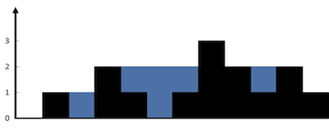

## Algorithm

[42. 接雨水](https://leetcode.cn/problems/trapping-rain-water/description/?envType=study-plan-v2&envId=top-100-liked)

### Description

给定 n 个非负整数表示每个宽度为 1 的柱子的高度图，计算按此排列的柱子，下雨之后能接多少雨水。

示例 1：



```
输入：height = [0,1,0,2,1,0,1,3,2,1,2,1]
输出：6
解释：上面是由数组 [0,1,0,2,1,0,1,3,2,1,2,1] 表示的高度图，在这种情况下，可以接 6 个单位的雨水（蓝色部分表示雨水）。
```

示例 2：

```
输入：height = [4,2,0,3,2,5]
输出：9
```

提示：

- n == height.length
- 1 <= n <= 2 * 104
- 0 <= height[i] <= 105

### Solution

```java
class Solution {
    public int trap(int[] height) {
        int left = 0, right = height.length - 1;
        int leftMax = 0, rightMax = 0;
        int result = 0;
        while (left < right) {
            if (height[left] < height[right]) {
                if (leftMax < height[left]) {
                    leftMax = height[left];
                } else {
                    result += (leftMax - height[left]);
                }
                left++;
            } else {
                if (rightMax < height[right]) {
                    rightMax = height[right];
                } else {
                    result += (rightMax - height[right]);
                }
                right--;
            }
        }
        return result;
    }
}
```

### Discuss

## Review


## Tip


## Share
