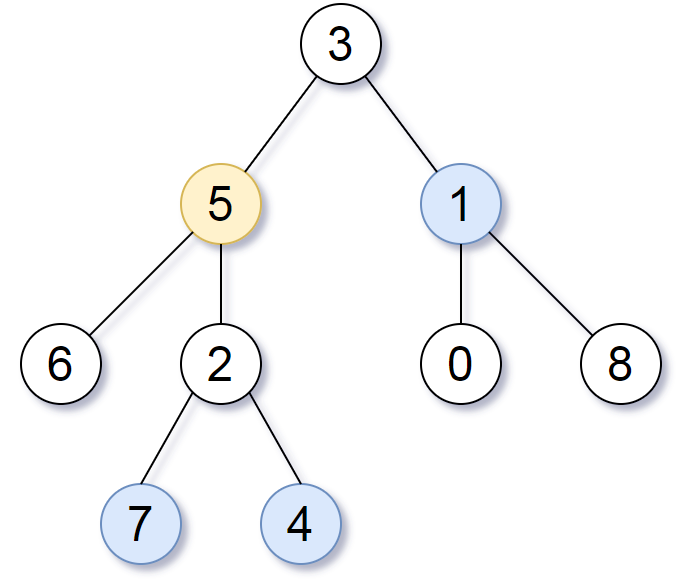

## Algorithm

[863. All Nodes Distance K in Binary Tree](https://leetcode.com/problems/all-nodes-distance-k-in-binary-tree/description/)

### Description

Given the root of a binary tree, the value of a target node target, and an integer k, return an array of the values of all nodes that have a distance k from the target node.

You can return the answer in any order.

Example 1:



```
Input: root = [3,5,1,6,2,0,8,null,null,7,4], target = 5, k = 2
Output: [7,4,1]
Explanation: The nodes that are a distance 2 from the target node (with value 5) have values 7, 4, and 1.
```

Example 2:

```
Input: root = [1], target = 1, k = 3
Output: []
```

Constraints:

- The number of nodes in the tree is in the range [1, 500].
- 0 <= Node.val <= 500
- All the values Node.val are unique.
- target is the value of one of the nodes in the tree.
- 0 <= k <= 1000

### Solution

```java
/**
 * Definition for a binary tree node.
 * public class TreeNode {
 *     int val;
 *     TreeNode left;
 *     TreeNode right;
 *     TreeNode(int x) { val = x; }
 * }
 */
class Solution {
    public List<Integer> distanceK(TreeNode root, TreeNode target, int k) {
       HashMap<TreeNode,TreeNode> map = new HashMap<>();
       mapParent(root,map);
       List<Integer> ans = new ArrayList<>();
       getNodes(target,k,map,new HashSet<>(),ans);
       return ans;
    }
    public void getNodes(TreeNode target, int k, HashMap<TreeNode,TreeNode> map, HashSet<TreeNode> set, List<Integer> list) {
        if(target==null) return;
        if(k==0) {
            list.add(target.val);
            return;
        }
        set.add(target);
        if(map.containsKey(target) && !set.contains(map.get(target))) getNodes(map.get(target),k-1,map,set,list);
        if(!set.contains(target.left)) getNodes(target.left,k-1,map,set,list);
        if(!set.contains(target.right)) getNodes(target.right,k-1,map,set,list);
    }
    public void mapParent(TreeNode root, HashMap<TreeNode,TreeNode> map) {
        if(root==null) return;
        if(root.left!=null) map.put(root.left,root);
        if(root.right!=null) map.put(root.right,root);
        mapParent(root.left,map);
        mapParent(root.right,map);
    }
}
```

### Discuss

## Review


## Tip


## Share
