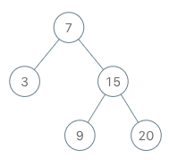

## Algorithm

[173. Binary Search Tree Iterator](https://leetcode.com/problems/binary-search-tree-iterator/)

### Description

Implement the BSTIterator class that represents an iterator over the in-order traversal of a binary search tree (BST):

- BSTIterator(TreeNode root) Initializes an object of the BSTIterator class. The root of the BST is given as part of the constructor. The pointer should be initialized to a non-existent number smaller than any element in the BST.
- boolean hasNext() Returns true if there exists a number in the traversal to the right of the pointer, otherwise returns false.
- int next() Moves the pointer to the right, then returns the number at the pointer.

Notice that by initializing the pointer to a non-existent smallest number, the first call to next() will return the smallest element in the BST.

You may assume that next() calls will always be valid. That is, there will be at least a next number in the in-order traversal when next() is called.


Example 1:



```
Input
["BSTIterator", "next", "next", "hasNext", "next", "hasNext", "next", "hasNext", "next", "hasNext"]
[[[7, 3, 15, null, null, 9, 20]], [], [], [], [], [], [], [], [], []]
Output
[null, 3, 7, true, 9, true, 15, true, 20, false]

Explanation
BSTIterator bSTIterator = new BSTIterator([7, 3, 15, null, null, 9, 20]);
bSTIterator.next();    // return 3
bSTIterator.next();    // return 7
bSTIterator.hasNext(); // return True
bSTIterator.next();    // return 9
bSTIterator.hasNext(); // return True
bSTIterator.next();    // return 15
bSTIterator.hasNext(); // return True
bSTIterator.next();    // return 20
bSTIterator.hasNext(); // return False
```

Constraints:

- The number of nodes in the tree is in the range [1, 105].
- 0 <= Node.val <= 106
- At most 105 calls will be made to hasNext, and next.


Follow up:

Could you implement next() and hasNext() to run in average O(1) time and use O(h) memory, where h is the height of the tree?

### Solution

```java
/**
 * Definition for a binary tree node.
 * public class TreeNode {
 *     int val;
 *     TreeNode left;
 *     TreeNode right;
 *     TreeNode() {}
 *     TreeNode(int val) { this.val = val; }
 *     TreeNode(int val, TreeNode left, TreeNode right) {
 *         this.val = val;
 *         this.left = left;
 *         this.right = right;
 *     }
 * }
 */
class BSTIterator {

    List<Integer> li = null ;
    Iterator it = null ;
    private void traverse( TreeNode root , List li )
    {
        if(root != null){
            traverse(root.left, li);
            li.add(root.val);
            traverse(root.right, li);
        }
    }

    public BSTIterator(TreeNode root)
    {
        li = new ArrayList<Integer>() ;
        traverse(root, li);
        it = li.listIterator();
    }

    public int next()
    {
        return (int)it.next() ;
    }

    public boolean hasNext()
    {
        return it.hasNext();
    }
}

/**
 * Your BSTIterator object will be instantiated and called as such:
 * BSTIterator obj = new BSTIterator(root);
 * int param_1 = obj.next();
 * boolean param_2 = obj.hasNext();
 */
```

### Discuss

## Review


## Tip


## Share
