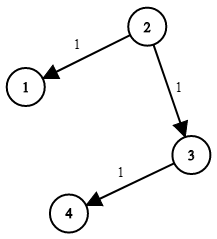

## Algorithm

[743. Network Delay Time](https://leetcode.com/problems/network-delay-time/description/)

### Description

You are given a network of n nodes, labeled from 1 to n. You are also given times, a list of travel times as directed edges times[i] = (ui, vi, wi), where ui is the source node, vi is the target node, and wi is the time it takes for a signal to travel from source to target.

We will send a signal from a given node k. Return the minimum time it takes for all the n nodes to receive the signal. If it is impossible for all the n nodes to receive the signal, return -1.


Example 1:



```
Input: times = [[2,1,1],[2,3,1],[3,4,1]], n = 4, k = 2
Output: 2
```

Example 2:

```
Input: times = [[1,2,1]], n = 2, k = 1
Output: 1
```

Example 3:

```
Input: times = [[1,2,1]], n = 2, k = 2
Output: -1
```

Constraints:

- 1 <= k <= n <= 100
- 1 <= times.length <= 6000
- times[i].length == 3
- 1 <= ui, vi <= n
- ui != vi
- 0 <= wi <= 100
- All the pairs (ui, vi) are unique. (i.e., no multiple edges.)

### Solution

Dijkstra
- TC: O(E + Elog(E))
- SC: O(V+E)

```java
class Solution {
    record Node(int i, int t) {}
    public int networkDelayTime(int[][] times, int n, int k) {
        // create graph
        List<Node>[] g = new List[n];
        for (int i = 0; i < n; i++) g[i] = new ArrayList<>();
        for (var t : times) g[t[0]-1].add(new Node(t[1]-1, t[2]));

        int[] time = new int[n];
        Queue<Integer> q = new PriorityQueue<>((u, v) -> time[u]-time[v]);
        Arrays.fill(time, Integer.MAX_VALUE);
        time[--k] = 0;
        q.offer(k);

        while (!q.isEmpty()) {
            var cur = q.poll();
            for (var next : g[cur]) {
                int t2 = time[cur] + next.t;
                if (t2 >= time[next.i]) continue;
                time[next.i] = t2;
                q.offer(next.i);
            }
        }

        int res = time[0];
        for (var t : time) if (t == Integer.MAX_VALUE) return -1; else if (t > res) res = t;
        return res;
    }
}
```


Bellman Ford
- TC: O(V*E) ==> n^3 (best O(E) => O(n^2))
- SC: O(N)

```java
class Solution {
    private final static int MAX = 1_000_000_000;
    public int networkDelayTime(int[][] times, int n, int k) {
        int[] time = new int[n+1];
        Arrays.fill(time, MAX);
        time[k] = time[0] = 0; // time[0] is garbage

        for (int i = 1; i < n; i++) { // for n nodes, we iterate max n-1 times
            boolean canRelax = false;
            for (var e : times) if (time[e[0]] + e[2] < time[e[1]]) {
                time[e[1]] = time[e[0]] + e[2];
                canRelax = true;
            }
            if (!canRelax) break;
        }

        int res = time[1];
        for (var t : time) if (t == MAX) return -1; else if (t > res) res = t;
        return res;
    }
}
```

SPFA
- TC: Worst: O(V*E) same as Bellman-Ford. Avg: O(E)
- SC: O(V)

```Java
class Solution {
    record Node (int i, int t) {}
    public int networkDelayTime(int[][] times, int n, int k) {
        // create graph
        List<Node>[] g = new List[n];
        for (int i = 0; i < n; i++) g[i] = new ArrayList<>();
        for (var t : times) g[t[0]-1].add(new Node(t[1]-1, t[2]));

        int[] time = new int[n];
        Arrays.fill(time, Integer.MAX_VALUE);
        time[--k] = 0;
        boolean[] inQ = new boolean[n];
        Queue<Integer> q = new ArrayDeque<>();
        q.offer(k);

        while (!q.isEmpty()) {
            int cur = q.poll();
            inQ[cur] = false;
            for (var next : g[cur]) {
                if (time[cur] + next.t < time[next.i]) {
                    time[next.i] = time[cur] + next.t;
                    if (!inQ[next.i]) {
                        q.offer(next.i);
                        inQ[next.i] = true;
                    }
                }
            }
        }

        int res = time[0];
        for (var t : time) if (t == Integer.MAX_VALUE) return -1; else if (t > res) res = t;
        return res;
    }
}
```


Floyd-Warshall
- TC: O(V^3)
- SC: O(V^2)

```java
class Solution {
    private final static int MAX = 1_000_000_000; // for convenience
    public int networkDelayTime(int[][] times, int n, int k) {
        int[][] time = new int[n][n]; // we dont use 0
        for (var t : time) Arrays.fill(t, MAX);
        for (int i = 0; i < n; i++) time[i][i] = 0;
        for (var t : times) time[t[0]-1][t[1]-1] = t[2]; // fill in the init matrix

         // m as middle, intermediate
        for (int m = 0; m < n; m++) for (int i = 0; i < n; i++) for (int j = 0; j < n; j++)
            if (time[i][m] + time[m][j] < time[i][j]) time[i][j] = time[i][m] + time[m][j];

        int res = time[--k][0];
        for (var t : time[k]) if (t == MAX) return -1; else if (t > res) res = t;
        return res;
    }
}
```

### Discuss

## Review


## Tip


## Share
