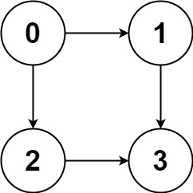

## Algorithm

[797. All Paths From Source to Target](https://leetcode.com/problems/all-paths-from-source-to-target/description/)

### Description

Given a directed acyclic graph (DAG) of n nodes labeled from 0 to n - 1, find all possible paths from node 0 to node n - 1 and return them in any order.

The graph is given as follows: graph[i] is a list of all nodes you can visit from node i (i.e., there is a directed edge from node i to node graph[i][j]).


Example 1:



```
Input: graph = [[1,2],[3],[3],[]]
Output: [[0,1,3],[0,2,3]]
Explanation: There are two paths: 0 -> 1 -> 3 and 0 -> 2 -> 3.
```

Example 2:


```
Input: graph = [[4,3,1],[3,2,4],[3],[4],[]]
Output: [[0,4],[0,3,4],[0,1,3,4],[0,1,2,3,4],[0,1,4]]
```

Constraints:

- n == graph.length
- 2 <= n <= 15
- 0 <= graph[i][j] < n
- graph[i][j] != i (i.e., there will be no self-loops).
- All the elements of graph[i] are unique.
- The input graph is guaranteed to be a DAG.

### Solution

```java
class Solution {
    private final List<List<Integer>> allPaths = new ArrayList<>();

    public List<List<Integer>> allPathsSourceTarget(int[][] graph) {
        Map<Integer, List<Integer>> edges = new HashMap<>();
        for (int i = 0; i < graph.length; i++) {
            for (int j = 0; j < graph[i].length; j++) {
                edges.computeIfAbsent(i, val -> new ArrayList<>()).add(graph[i][j]);
            }
        }
        helper(edges, new ArrayList<>(), 0, graph.length - 1);
        return allPaths;
    }

    private void helper(Map<Integer, List<Integer>> edges, List<Integer> curPaths, int source, int target) {
        curPaths.add(source);
        if (source == target) {
            allPaths.add(curPaths);
            return;
        }

        List<Integer> nodes = edges.get(source);
        if (nodes == null) return;
        for (int node : nodes) {
            helper(edges, new ArrayList<>(curPaths), node, target);
        }
    }
}
```

### Discuss

## Review


## Tip


## Share
