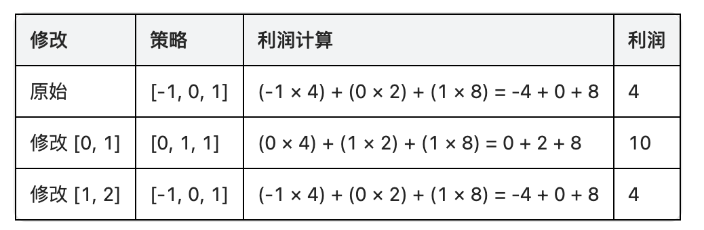
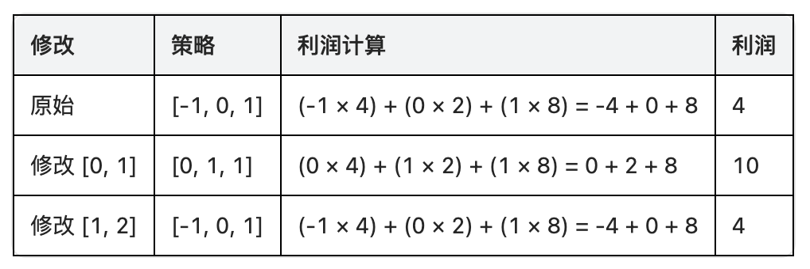

## Algorithm

[3652. 按策略买卖股票的最佳时机](https://leetcode.cn/problems/best-time-to-buy-and-sell-stock-using-strategy/description/)

### Description

给你两个整数数组 prices 和 strategy，其中：

- prices[i] 表示第 i 天某股票的价格。
- strategy[i] 表示第 i 天的交易策略，其中：
- -1 表示买入一单位股票。
- 0 表示持有股票。
- 1 表示卖出一单位股票。

同时给你一个 偶数 整数 k，你可以对 strategy 进行 最多一次 修改。一次修改包括：

- 选择 strategy 中恰好 k 个 连续 元素。
- 将前 k / 2 个元素设为 0（持有）。
- 将后 k / 2 个元素设为 1（卖出）。

利润 定义为所有天数中 strategy[i] * prices[i] 的 总和 。

返回你可以获得的 最大 可能利润。

注意： 没有预算或股票持有数量的限制，因此所有买入和卖出操作均可行，无需考虑过去的操作。


示例 1：

```
输入： prices = [4,2,8], strategy = [-1,0,1], k = 2
输出： 10
```

解释：



因此，最大可能利润是 10，通过修改子数组 [0, 1] 实现。

示例 2：

```
输入： prices = [5,4,3], strategy = [1,1,0], k = 2

输出： 9
```

解释：



提示：

- 2 <= prices.length == strategy.length <= 105
- 1 <= prices[i] <= 105
- -1 <= strategy[i] <= 1
- 2 <= k <= prices.length
- k 是偶数

### Solution

```java
class Solution {
    public long maxProfit(int[] prices, int[] strategy, int k) {
        int n = prices.length;
        long[] sum = new long[n + 1];
        long[] sumSell = new long[n + 1];
        for (int i = 0; i < n; i++) {
            sum[i + 1] = sum[i] + prices[i] * strategy[i];
            sumSell[i + 1] = sumSell[i] + prices[i];
        }

        long ans = sum[n]; // 不修改
        for (int i = k; i <= n; i++) {
            long res = sum[i - k] + sum[n] - sum[i] + sumSell[i] - sumSell[i - k / 2];
            ans = Math.max(ans, res);
        }
        return ans;
    }
}
```

### Discuss

## Review


## Tip


## Share
