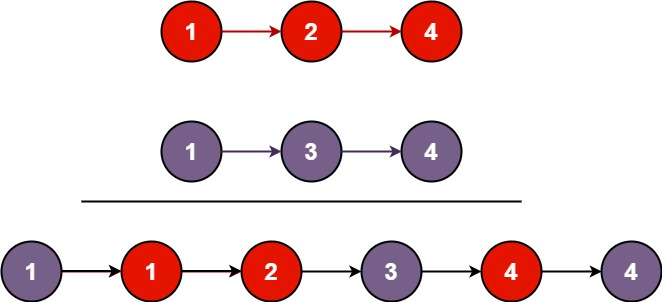

## Algorithm

[21. Merge Two Sorted Lists](https://leetcode.com/problems/merge-two-sorted-lists/)

### Description

You are given the heads of two sorted linked lists list1 and list2.

Merge the two lists in a one sorted list. The list should be made by splicing together the nodes of the first two lists.

Return the head of the merged linked list.

Example 1:



```
Input: list1 = [1,2,4], list2 = [1,3,4]
Output: [1,1,2,3,4,4]
```

Example 2:

```
Input: list1 = [], list2 = []
Output: []
```

Example 3:

```
Input: list1 = [], list2 = [0]
Output: [0]
```

Constraints:

- The number of nodes in both lists is in the range [0, 50].
- -100 <= Node.val <= 100
- Both list1 and list2 are sorted in non-decreasing order.

### Solution

```java
/**
 * Definition for singly-linked list.
 * public class ListNode {
 *     int val;
 *     ListNode next;
 *     ListNode(int x) { val = x; }
 * }
 */
class Solution {
    public ListNode mergeTwoLists(ListNode l1, ListNode l2) {
        if(l1==null){
            return l2;
        }else if(l2==null){
            return l1;
        }else if(l1.val<l2.val){
            l1.next = mergeTwoLists(l1.next, l2);
            return l1;
        }else{
            l2.next = mergeTwoLists(l1, l2.next);
            return l2;
        }
    }
}
```

### Discuss

## Review


## Tip


## Share
