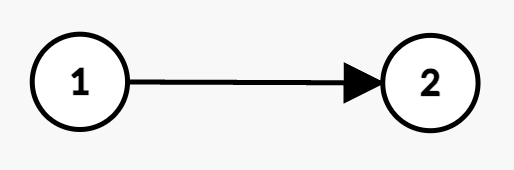
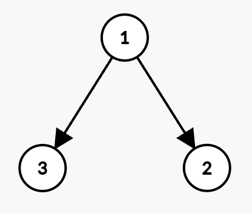
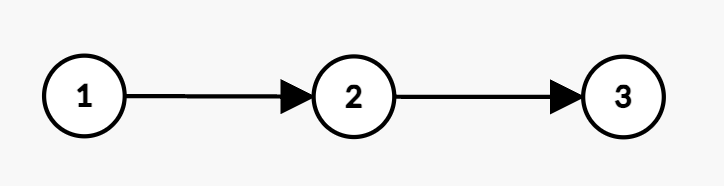

## Algorithm

[3562. 折扣价交易股票的最大利润](https://leetcode.cn/problems/maximum-profit-from-trading-stocks-with-discounts/description/)

### Description

给你一个整数n，表示公司中员工的数量。每位员工都分配了一个从 1 到 n 的唯一 ID ，其中员工 1 是 CEO。另给你两个下标从 1 开始的整数数组 present 和 future，两个数组的长度均为 n，具体定义如下：

- present[i] 表示第 i 位员工今天可以购买股票的 当前价格 。
- future[i] 表示第 i 位员工明天可以卖出股票的 预期价格 。

公司的层级关系由二维整数数组 hierarchy 表示，其中 hierarchy[i] = [ui, vi] 表示员工 ui 是员工 vi 的直属上司。

此外，再给你一个整数 budget，表示可用于投资的总预算。

公司有一项折扣政策：如果某位员工的直属上司购买了自己的股票，那么该员工可以以 半价 购买自己的股票（即 floor(present[v] / 2)）。

请返回在不超过给定预算的情况下可以获得的 最大利润。

注意：

- 每只股票最多只能购买一次。
- 不能使用股票未来的收益来增加投资预算，购买只能依赖于 budget。

示例 1：

```
输入： n = 2, present = [1,2], future = [4,3], hierarchy = [[1,2]], budget = 3
输出： 5
```

解释：



- 员工 1 以价格 1 购买股票，获得利润 4 - 1 = 3。
- 由于员工 1 是员工 2 的直属上司，员工 2 可以以折扣价 floor(2 / 2) = 1 购买股票。
- 员工 2 以价格 1 购买股票，获得利润 3 - 1 = 2。
- 总购买成本为 1 + 1 = 2 <= budget，因此最大总利润为 3 + 2 = 5。


示例 2：

```
输入： n = 2, present = [3,4], future = [5,8], hierarchy = [[1,2]], budget = 4
输出： 4
```

解释：


- 员工 2 以价格 4 购买股票，获得利润 8 - 4 = 4。
- 由于两位员工无法同时购买，最大利润为 4。

示例 3：

```
输入： n = 3, present = [4,6,8], future = [7,9,11], hierarchy = [[1,2],[1,3]], budget = 10
输出： 10
```

解释：



- 员工 1 以价格 4 购买股票，获得利润 7 - 4 = 3。
- 员工 3 可获得折扣价 floor(8 / 2) = 4，获得利润 11 - 4 = 7。
- 员工 1 和员工 3 的总购买成本为 4 + 4 = 8 <= budget，因此最大总利润为 3 + 7 = 10。


示例 4：

```
输入： n = 3, present = [5,2,3], future = [8,5,6], hierarchy = [[1,2],[2,3]], budget = 7
输出： 12
```

解释：



- 员工 1 以价格 5 购买股票，获得利润 8 - 5 = 3。
- 员工 2 可获得折扣价 floor(2 / 2) = 1，获得利润 5 - 1 = 4。
- 员工 3 可获得折扣价 floor(3 / 2) = 1，获得利润 6 - 1 = 5。
- 总成本为 5 + 1 + 1 = 7 <= budget，因此最大总利润为 3 + 4 + 5 = 12。

提示：

- 1 <= n <= 160
- present.length, future.length == n
- 1 <= present[i], future[i] <= 50
- hierarchy.length == n - 1
- hierarchy[i] == [ui, vi]
- 1 <= ui, vi <= n
- ui != vi
- 1 <= budget <= 160
- 没有重复的边。
- 员工 1 是所有员工的直接或间接上司。
- 输入的图 hierarchy 保证 无环。

### Solution

```java
class Solution {
    public int maxProfit(int n, int[] present, int[] future, int[][] hierarchy, int budget) {
        List<Integer>[] g = new ArrayList[n];
        Arrays.setAll(g, i -> new ArrayList<>());
        for (int[] e : hierarchy) {
            g[e[0] - 1].add(e[1] - 1);
        }

        int[][] f0 = dfs(0, g, present, future, budget);
        return f0[budget][0];
    }

    private int[][] dfs(int x, List<Integer>[] g, int[] present, int[] future, int budget) {
        // 计算从 x 的所有儿子子树 y 中，能得到的最大利润之和
        int[][] subF = new int[budget + 1][2];
        for (int y : g[x]) {
            int[][] fy = dfs(y, g, present, future, budget);
            for (int j = budget; j >= 0; j--) {
                // 枚举子树 y 的预算为 jy
                // 当作一个体积为 jy，价值为 fy[jy][k] 的物品
                for (int jy = 0; jy <= j; jy++) {
                    for (int k = 0; k < 2; k++) {
                        subF[j][k] = Math.max(subF[j][k], subF[j - jy][k] + fy[jy][k]);
                    }
                }
            }
        }

        int[][] f = new int[budget + 1][2];
        for (int j = 0; j <= budget; j++) {
            for (int k = 0; k < 2; k++) {
                int cost = present[x] / (k + 1);
                if (j >= cost) {
                    // 不买 x，转移来源是 subF[j][0]
                    // 买 x，转移来源为 subF[j-cost][1]，因为对于子树来说，父节点一定买
                    f[j][k] = Math.max(subF[j][0], subF[j - cost][1] + future[x] - cost);
                } else { // 只能不买 x
                    f[j][k] = subF[j][0];
                }
            }
        }
        return f;
    }
}
```

### Discuss

## Review


## Tip


## Share
