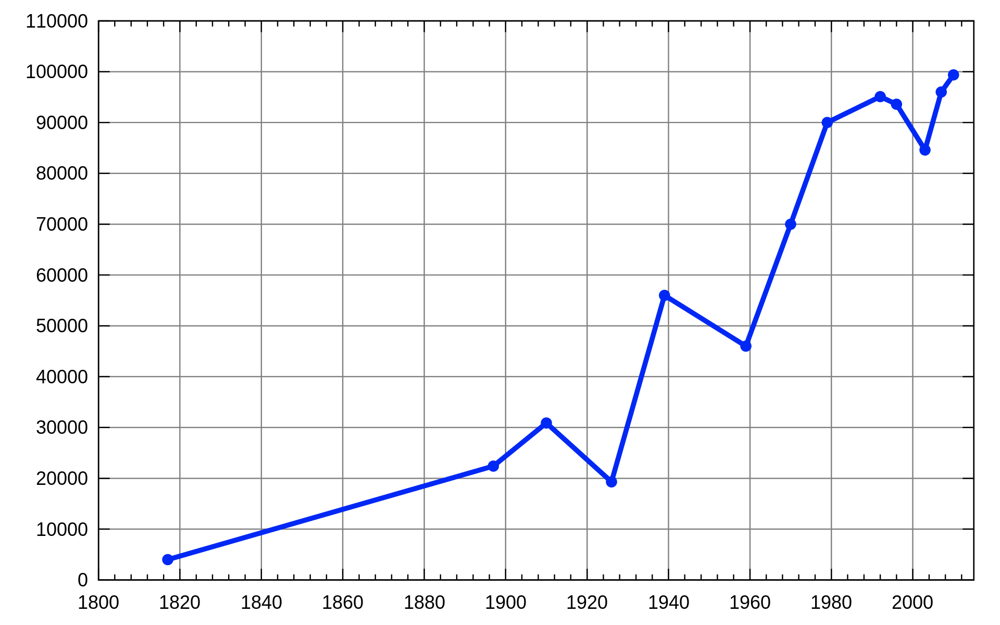
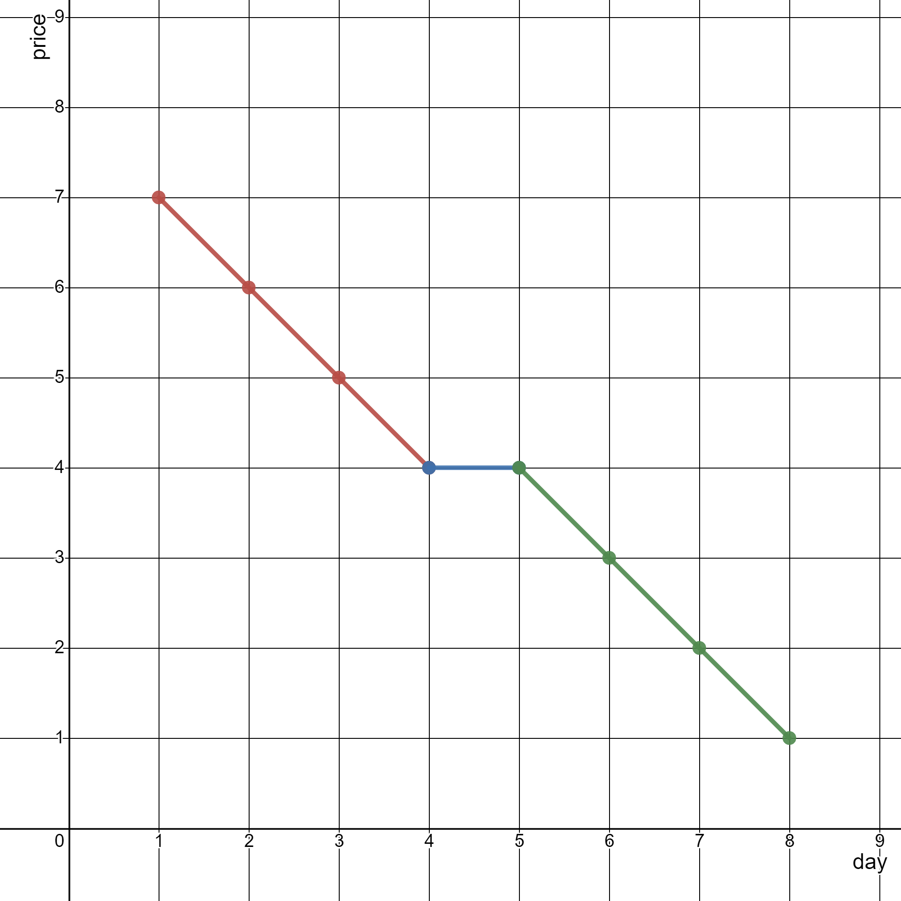
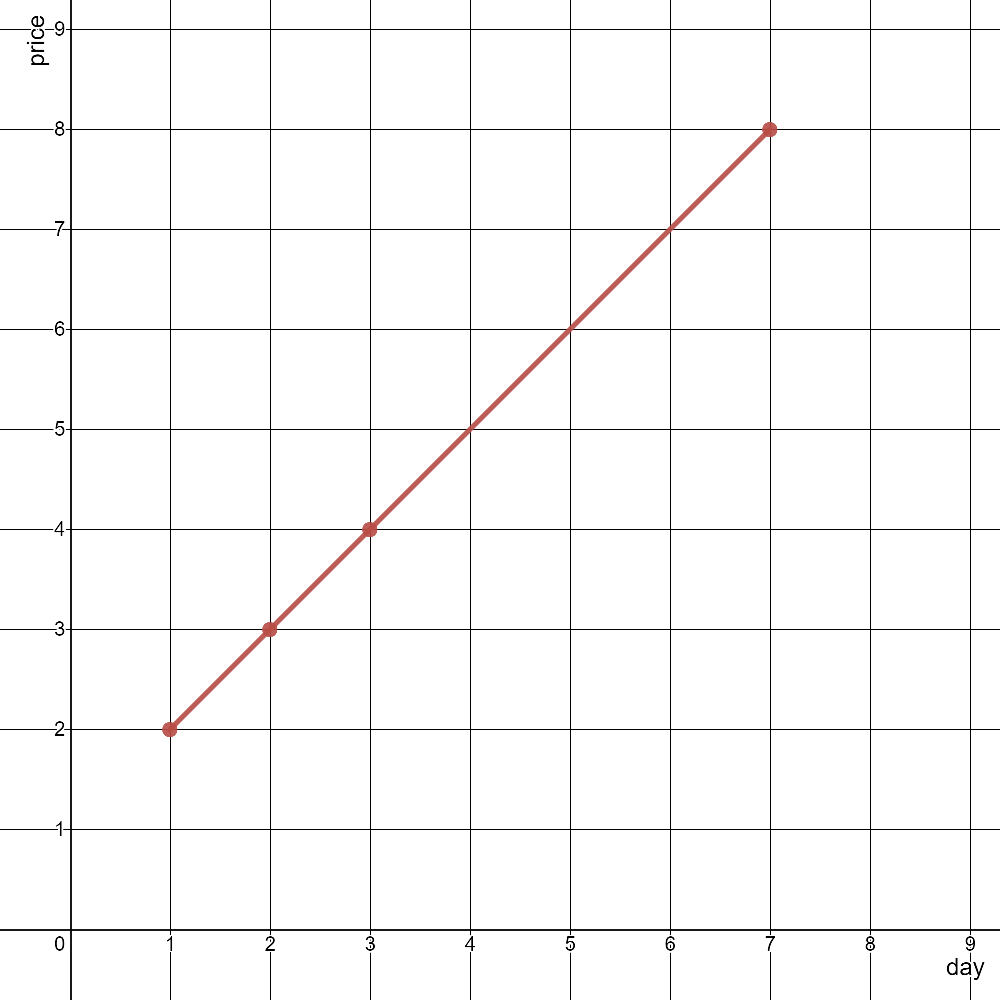

## Algorithm

[2280. 表示一个折线图的最少线段数](https://leetcode.cn/problems/minimum-lines-to-represent-a-line-chart/description/)

### Description

给你一个二维整数数组 stockPrices ，其中 stockPrices[i] = [dayi, pricei] 表示股票在 dayi 的价格为 pricei 。折线图 是一个二维平面上的若干个点组成的图，横坐标表示日期，纵坐标表示价格，折线图由相邻的点连接而成。比方说下图是一个例子：



请你返回要表示一个折线图所需要的 最少线段数 。

示例 1：



```
输入：stockPrices = [[1,7],[2,6],[3,5],[4,4],[5,4],[6,3],[7,2],[8,1]]
输出：3
解释：
上图为输入对应的图，横坐标表示日期，纵坐标表示价格。
以下 3 个线段可以表示折线图：
- 线段 1 （红色）从 (1,7) 到 (4,4) ，经过 (1,7) ，(2,6) ，(3,5) 和 (4,4) 。
- 线段 2 （蓝色）从 (4,4) 到 (5,4) 。
- 线段 3 （绿色）从 (5,4) 到 (8,1) ，经过 (5,4) ，(6,3) ，(7,2) 和 (8,1) 。
可以证明，无法用少于 3 条线段表示这个折线图。
```

示例 2：



```
输入：stockPrices = [[3,4],[1,2],[7,8],[2,3]]
输出：1
解释：
如上图所示，折线图可以用一条线段表示。
```

提示：

- 1 <= stockPrices.length <= 105
- stockPrices[i].length == 2
- 1 <= dayi, pricei <= 109
- 所有 dayi 互不相同 。

### Solution

```java
class Solution {
    public int minimumLines(int[][] stockPrices) {
        int ans = 1;
        Arrays.sort(stockPrices, (a, b) -> a[0] - b[0]);
        int n = stockPrices.length;
        if (n == 1)
            return 0;
        for (int i = 0; i < n - 2; i++) {
            int dx = stockPrices[i + 1][0] - stockPrices[i][0];
            int dy = stockPrices[i + 1][1] - stockPrices[i][1];
            int dxx = stockPrices[i + 2][0] - stockPrices[i + 1][0];
            int dyy = stockPrices[i + 2][1] - stockPrices[i + 1][1];
            if ((long) dx * dyy != (long) dy * dxx) {
                ans++;
            }
        }
        return ans;
    }
}
```

### Discuss

我们令 res 的初始值为 1（代表 stockPrices[0] 与 stockPrices[1] 构成的线段），随后，我们从 i=2 开始遍历相邻点对，并判断 stockPrices[i] 与 stockPrices[i−1] 构成的线段是否可以与前一组相邻点对 stockPrices[i−1] 与 stockPrices[i−2] 构成的线段合并，即两条线段的斜率是否相等。


## Review


## Tip


## Share
