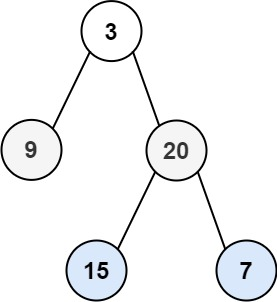

## Algorithm

[102. Binary Tree Level Order Traversal](https://leetcode.com/problems/binary-tree-level-order-traversal/)

### Description

Given the root of a binary tree, return the level order traversal of its nodes' values. (i.e., from left to right, level by level).


Example 1:



```
Input: root = [3,9,20,null,null,15,7]
Output: [[3],[9,20],[15,7]]
```

Example 2:

```
Input: root = [1]
Output: [[1]]
```

Example 3:

```
Input: root = []
Output: []
```

Constraints:

- The number of nodes in the tree is in the range [0, 2000].
- -1000 <= Node.val <= 1000

### Solution

```java
/**
 * Definition for a binary tree node.
 * public class TreeNode {
 *     int val;
 *     TreeNode left;
 *     TreeNode right;
 *     TreeNode() {}
 *     TreeNode(int val) { this.val = val; }
 *     TreeNode(int val, TreeNode left, TreeNode right) {
 *         this.val = val;
 *         this.left = left;
 *         this.right = right;
 *     }
 * }
 */
class Solution {
    public List<List<Integer>> levelOrder(TreeNode root) {
        List<List<Integer>> lists = new ArrayList<>();
        Queue<TreeNode> queue = new LinkedList();
        if(root==null){
            return lists;
        }
        queue.offer(root);
        while(!queue.isEmpty()){
            List<Integer> list = new ArrayList<>();
            int size = queue.size();
            for(int i=0;i<size;i++){
                TreeNode node = queue.poll();
                if(node.left!=null){
                    queue.offer(node.left);
                }
                if(node.right!=null){
                    queue.offer(node.right);
                }
                list.add(node.val);
            }
            lists.add(list);
        }
        return lists;
    }
}
```

### Discuss

## Review


## Tip


## Share
