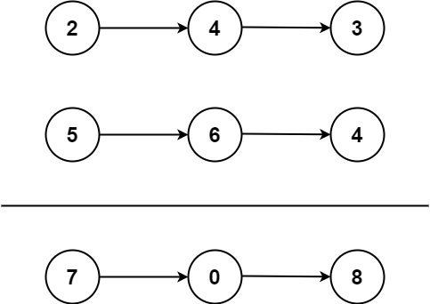

## Algorithm

[2. Add Two Numbers](https://leetcode.com/problems/add-two-numbers/)

### Description

You are given two non-empty linked lists representing two non-negative integers. The digits are stored in reverse order, and each of their nodes contains a single digit. Add the two numbers and return the sum as a linked list.

You may assume the two numbers do not contain any leading zero, except the number 0 itself.


Example 1:



```
Input: l1 = [2,4,3], l2 = [5,6,4]
Output: [7,0,8]
Explanation: 342 + 465 = 807.
```

Example 2:

```
Input: l1 = [0], l2 = [0]
Output: [0]
```

Example 3:

```
Input: l1 = [9,9,9,9,9,9,9], l2 = [9,9,9,9]
Output: [8,9,9,9,0,0,0,1]
```

Constraints:

- The number of nodes in each linked list is in the range [1, 100].
- 0 <= Node.val <= 9
- It is guaranteed that the list represents a number that does not have leading zeros.

### Solution

```java
/**
 * Definition for singly-linked list.
 * public class ListNode {
 *     int val;
 *     ListNode next;
 *     ListNode(int x) { val = x; }
 * }
 */
class Solution {
    public ListNode addTwoNumbers(ListNode l1, ListNode l2) {
        if(l1==null||l2==null) return null;
        int value1,value2=0;
        ListNode pre = new ListNode(0);
        ListNode result = pre;
        while(l1!=null&&l2!=null){
            value1 = (l1.val+l2.val+value2)%10;
            value2 = (l1.val+l2.val+value2)/10;
            pre.next = new ListNode(value1);
            pre = pre.next;
            l1 = l1.next;
            l2 = l2.next;
            if(l1 == null && l2 == null){
                break;
            }
            if(l1 == null && l2 != null){
                l1 = new ListNode(0);
            }
            if(l1 != null && l2 == null){
                l2 = new ListNode(0);
            }
        }
        if(value2>0){
            pre.next = new ListNode(value2);
        }
        return result.next;
    }
}
```

### Discuss

## Review


## Tip


## Share
