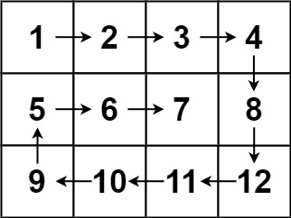

## Algorithm

[54. Spiral Matrix](https://leetcode.com/problems/spiral-matrix/)

### Description

Given an m x n matrix, return all elements of the matrix in spiral order.

Example 1:


```
Input: matrix = [[1,2,3],[4,5,6],[7,8,9]]
Output: [1,2,3,6,9,8,7,4,5]
```

Example 2:



```
Input: matrix = [[1,2,3,4],[5,6,7,8],[9,10,11,12]]
Output: [1,2,3,4,8,12,11,10,9,5,6,7]
```

Constraints:

- m == matrix.length
- n == matrix[i].length
- 1 <= m, n <= 10
- -100 <= matrix[i][j] <= 100

### Solution

```java
class Solution {
    public List<Integer> spiralOrder(int[][] matrix) {
        List<Integer> res = new ArrayList<Integer>();
        if(matrix.length==0){
            return res;
        }
        int rowBegin = 0;
        int rowEnd = matrix.length-1;
        int colBegin = 0;
        int colEnd = matrix[0].length - 1;
        while (rowBegin <= rowEnd && colBegin <= colEnd){
            // Traverse Right
            for (int j = colBegin; j <= colEnd; j ++) {
                res.add(matrix[rowBegin][j]);
            }
            rowBegin++;

            // Traverse Down
            for (int j = rowBegin; j <= rowEnd; j ++) {
                res.add(matrix[j][colEnd]);
            }
            colEnd--;

            if (rowBegin <= rowEnd) {
                // Traverse Left
                for (int j = colEnd; j >= colBegin; j --) {
                    res.add(matrix[rowEnd][j]);
                }
            }
            rowEnd--;

            if (colBegin <= colEnd) {
                // Traver Up
                for (int j = rowEnd; j >= rowBegin; j --) {
                    res.add(matrix[j][colBegin]);
                }
            }
            colBegin++;
        }
        return res;
    }
}
```

### Discuss

## Review


## Tip


## Share
