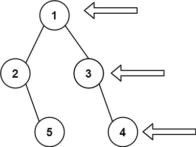

## Algorithm

[199. Binary Tree Right Side View](https://leetcode.com/problems/binary-tree-right-side-view/)

### Description

Given the root of a binary tree, imagine yourself standing on the right side of it, return the values of the nodes you can see ordered from top to bottom.

Example 1:



```
Input: root = [1,2,3,null,5,null,4]
Output: [1,3,4]
```

Example 2:

```
Input: root = [1,null,3]
Output: [1,3]
```

Example 3:

```
Input: root = []
Output: []
```

Constraints:

- The number of nodes in the tree is in the range [0, 100].
- -100 <= Node.val <= 100

### Solution

```java
/**
 * Definition for a binary tree node.
 * public class TreeNode {
 *     int val;
 *     TreeNode left;
 *     TreeNode right;
 *     TreeNode() {}
 *     TreeNode(int val) { this.val = val; }
 *     TreeNode(int val, TreeNode left, TreeNode right) {
 *         this.val = val;
 *         this.left = left;
 *         this.right = right;
 *     }
 * }
 */
class Solution {
    public List<Integer> rightSideView(TreeNode root) {
        List<Integer> list = new ArrayList<>();
        Queue<TreeNode> queue = new LinkedList<>();
        if(root == null){
          return list;
        }
        queue.add(root);
        while(!queue.isEmpty()){
            int size = queue.size();
            for(int i=0;i<size;i++){
                TreeNode node = queue.poll();
                if(node.left!=null){
                    queue.offer(node.left);
                }
                if(node.right!=null){
                    queue.offer(node.right);
                }
                if(i==size-1){
                    list.add(node.val);
                }
            }
        }
        return list;
    }
}
```

### Discuss

## Review


## Tip


## Share
