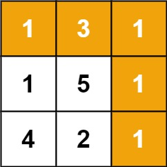

## Algorithm

[64. Minimum Path Sum](https://leetcode.com/problems/minimum-path-sum/)

### Description

Given a m x n grid filled with non-negative numbers, find a path from top left to bottom right, which minimizes the sum of all numbers along its path.

Note: You can only move either down or right at any point in time.

Example 1:



```
Input: grid = [[1,3,1],[1,5,1],[4,2,1]]
Output: 7
Explanation: Because the path 1 → 3 → 1 → 1 → 1 minimizes the sum.
```

Example 2:

```
Input: grid = [[1,2,3],[4,5,6]]
Output: 12
```

Constraints:

- m == grid.length
- n == grid[i].length
- 1 <= m, n <= 200
- 0 <= grid[i][j] <= 200

### Solution

```java
class Solution {
    public int minPathSum(int[][] grid) {
       int m = grid.length;
        int n = grid[0].length;
        for (int row = 1; row < m; row++) {
            grid[row][0] += grid[row - 1][0];
        }
        for (int col = 1; col < n; col++) {
            grid[0][col] += grid[0][col - 1];
        }
        for (int i = 1; i < m; i++) {
            for (int j = 1; j < n; j++) {
                grid[i][j] += Math.min(grid[i - 1][j], grid[i][j - 1]);
            }
        }

        return grid[m - 1][n - 1];
    }
}
```

### Discuss

## Review


## Tip


## Share
