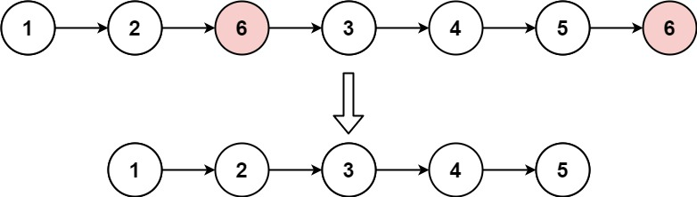

## Algorithm

[203. Remove Linked List Elements](https://leetcode.com/problems/remove-linked-list-elements/)

### Description

Given the head of a linked list and an integer val, remove all the nodes of the linked list that has Node.val == val, and return the new head.

Example 1:



```
Input: head = [1,2,6,3,4,5,6], val = 6
Output: [1,2,3,4,5]
```

Example 2:

```
Input: head = [], val = 1
Output: []
```

Example 3:

```
Input: head = [7,7,7,7], val = 7
Output: []
```

Constraints:

- The number of nodes in the list is in the range [0, 104].
- 1 <= Node.val <= 50
- 0 <= val <= 50

### Solution

```java
/**
 * Definition for singly-linked list.
 * public class ListNode {
 *     int val;
 *     ListNode next;
 *     ListNode() {}
 *     ListNode(int val) { this.val = val; }
 *     ListNode(int val, ListNode next) { this.val = val; this.next = next; }
 * }
 */
class Solution {
    public ListNode removeElements(ListNode head, int val) {
        if (head == null) {
            return head;
        }
        // 因为删除可能涉及到头节点，所以设置dummy节点，统一操作
        ListNode dummy = new ListNode(-1, head);
        ListNode pre = dummy;
        ListNode cur = head;
        while (cur != null) {
            if (cur.val == val) {
                pre.next = cur.next;
            } else {
                pre = cur;
            }
            cur = cur.next;
        }
        return dummy.next;
    }
}
```

不添加虚拟头节点

```Java
/**
 * 不添加虚拟节点and pre Node方式
 * 时间复杂度 O(n)
 * 空间复杂度 O(1)
 * @param head
 * @param val
 * @return
 */
public ListNode removeElements(ListNode head, int val) {
    while(head!=null && head.val==val){
        head = head.next;
    }
    ListNode curr = head;
    while(curr!=null){
        while(curr.next!=null && curr.next.val == val){
            curr.next = curr.next.next;
        }
        curr = curr.next;
    }
    return head;
}
```

### Discuss

链表-添加虚拟头节点

## Review


## Tip


## Share
