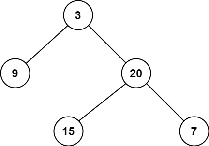

## Algorithm

[111. Minimum Depth of Binary Tree](https://leetcode.com/problems/minimum-depth-of-binary-tree/)

### Description

Given a binary tree, find its minimum depth.

The minimum depth is the number of nodes along the shortest path from the root node down to the nearest leaf node.

Note: A leaf is a node with no children.


Example 1:



```
Input: root = [3,9,20,null,null,15,7]
Output: 2
```

Example 2:

```
Input: root = [2,null,3,null,4,null,5,null,6]
Output: 5
```

Constraints:

- The number of nodes in the tree is in the range [0, 105].
- -1000 <= Node.val <= 1000

### Solution

```java
/**
 * Definition for a binary tree node.
 * public class TreeNode {
 *     int val;
 *     TreeNode left;
 *     TreeNode right;
 *     TreeNode(int x) { val = x; }
 * }
 */
class Solution {
    public int minDepth(TreeNode root) {
        if(root==null){
            return 0;
        }
        int left = minDepth(root.left);
        int right = minDepth(root.right);
        // 这一步很重要，注意只有一个分支的链表二叉树
        if(left == 0 || right == 0){
            return left+right+1;
        }
        return left<right?left+1:right+1;
    }
}
```

### Discuss

## Review


## Tip


## Share
