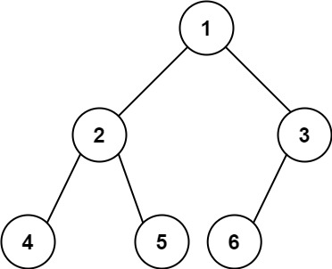

## Algorithm

[222. Count Complete Tree Nodes](https://leetcode.com/problems/count-complete-tree-nodes/)

### Description

Given the root of a complete binary tree, return the number of the nodes in the tree.

According to Wikipedia, every level, except possibly the last, is completely filled in a complete binary tree, and all nodes in the last level are as far left as possible. It can have between 1 and 2h nodes inclusive at the last level h.

Design an algorithm that runs in less than O(n) time complexity.


Example 1:



```
Input: root = [1,2,3,4,5,6]
Output: 6
```

Example 2:

```
Input: root = []
Output: 0
```

Example 3:

```
Input: root = [1]
Output: 1
```

Constraints:

- The number of nodes in the tree is in the range [0, 5 * 104].
- 0 <= Node.val <= 5 * 104
- The tree is guaranteed to be complete.

### Solution

```java
/**
 * Definition for a binary tree node.
 * public class TreeNode {
 *     int val;
 *     TreeNode left;
 *     TreeNode right;
 *     TreeNode() {}
 *     TreeNode(int val) { this.val = val; }
 *     TreeNode(int val, TreeNode left, TreeNode right) {
 *         this.val = val;
 *         this.left = left;
 *         this.right = right;
 *     }
 * }
 */
class Solution {
    public int countNodes(TreeNode root) {
        int[] result = new int[1];
        helper(root, result);
        return result[0];
    }
    public void helper(TreeNode root, int[] result){
        if(root == null) {
            return;
        }
        helper(root.left, result);
        result[0] = result[0]+1;
        helper(root.right, result);
    }
}
class Solution {
    // 通用递归解法
    public int countNodes(TreeNode root) {
        if(root == null) {
            return 0;
        }
        return countNodes(root.left) + countNodes(root.right) + 1;
    }
}
```

### Discuss

## Review


## Tip


## Share
