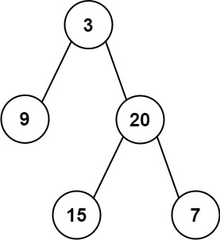

## Algorithm

[404. Sum of Left Leaves](https://leetcode.com/problems/sum-of-left-leaves/)

### Description

Given the root of a binary tree, return the sum of all left leaves.

A leaf is a node with no children. A left leaf is a leaf that is the left child of another node.

Example 1:



```
Input: root = [3,9,20,null,null,15,7]
Output: 24
Explanation: There are two left leaves in the binary tree, with values 9 and 15 respectively.
```

Example 2:

```
Input: root = [1]
Output: 0
```

Constraints:

- The number of nodes in the tree is in the range [1, 1000].
- -1000 <= Node.val <= 1000

### Solution

```java
/**
 * Definition for a binary tree node.
 * public class TreeNode {
 *     int val;
 *     TreeNode left;
 *     TreeNode right;
 *     TreeNode() {}
 *     TreeNode(int val) { this.val = val; }
 *     TreeNode(int val, TreeNode left, TreeNode right) {
 *         this.val = val;
 *         this.left = left;
 *         this.right = right;
 *     }
 * }
 */
class Solution {
    public int sumOfLeftLeaves(TreeNode root) {
        if(root==null){
          return 0;
        }
        if(root.left!=null&&root.left.left==null&&root.left.right==null){
          return root.left.val + sumOfLeftLeaves(root.right);
        }
        return sumOfLeftLeaves(root.left) + sumOfLeftLeaves(root.right);
    }
}
```

### Discuss

## Review


## Tip


## Share
