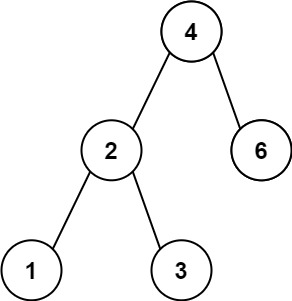
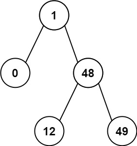

## Algorithm

[530. Minimum Absolute Difference in BST](https://leetcode.com/problems/minimum-absolute-difference-in-bst/)

### Description

Given the root of a Binary Search Tree (BST), return the minimum absolute difference between the values of any two different nodes in the tree.

Example 1:



```
Input: root = [4,2,6,1,3]
Output: 1
```

Example 2:



```
Input: root = [1,0,48,null,null,12,49]
Output: 1
```

Constraints:

- The number of nodes in the tree is in the range [2, 104].
- 0 <= Node.val <= 105


Note: This question is the same as 783: https://leetcode.com/problems/minimum-distance-between-bst-nodes/

### Solution

```java
/**
 * Definition for a binary tree node.
 * public class TreeNode {
 *     int val;
 *     TreeNode left;
 *     TreeNode right;
 *     TreeNode() {}
 *     TreeNode(int val) { this.val = val; }
 *     TreeNode(int val, TreeNode left, TreeNode right) {
 *         this.val = val;
 *         this.left = left;
 *         this.right = right;
 *     }
 * }
 */
class Solution {
    TreeNode prev = null;
    int minDiff = Integer.MAX_VALUE;
    public int getMinimumDifference(TreeNode root) {
        if(root==null||(root.left==null&&root.right==null)){
            return 0;
        }
        helper(root);
        return minDiff;
    }

    public void helper(TreeNode root){
        if(root!=null){
            helper(root.left);
            if(prev!=null){
                minDiff = Math.min(minDiff, Math.abs(prev.val - root.val));
            }
            prev = root;
            helper(root.right);
        }
    }
}
```

### Discuss

## Review


## Tip


## Share
