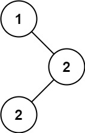

## Algorithm

[501. Find Mode in Binary Search Tree](https://leetcode.com/problems/find-mode-in-binary-search-tree)

### Description

Given the root of a binary search tree (BST) with duplicates, return all the mode(s) (i.e., the most frequently occurred element) in it.

If the tree has more than one mode, return them in any order.

Assume a BST is defined as follows:

- The left subtree of a node contains only nodes with keys less than or equal to the node's key.
- The right subtree of a node contains only nodes with keys greater than or equal to the node's key.
- Both the left and right subtrees must also be binary search trees.

Example 1:



```
Input: root = [1,null,2,2]
Output: [2]
```

Example 2:

```
Input: root = [0]
Output: [0]
```

Constraints:

- The number of nodes in the tree is in the range [1, 104].
- -105 <= Node.val <= 105


Follow up: Could you do that without using any extra space? (Assume that the implicit stack space incurred due to recursion does not count).


### Solution

```java
/**
 * Definition for a binary tree node.
 * public class TreeNode {
 *     int val;
 *     TreeNode left;
 *     TreeNode right;
 *     TreeNode() {}
 *     TreeNode(int val) { this.val = val; }
 *     TreeNode(int val, TreeNode left, TreeNode right) {
 *         this.val = val;
 *         this.left = left;
 *         this.right = right;
 *     }
 * }
 */
class Solution {
    private int count = -1;
	  private int lastVal = Integer.MAX_VALUE;
	  private int maxCount = 0;
	  private List<Integer> list  = new LinkedList<>();

    public int[] findMode(TreeNode root) {
        find(root);
        if(count>maxCount) {
        	list.clear();
        	list.add(lastVal);
        }else if(count == maxCount) {
        	list.add(lastVal);
        }
        int[] result = new int[list.size()];
        for(int i =0;i<list.size();i++) {
        	result[i] = list.get(i);
        }
        return result;
    }

    private void find (TreeNode root) {
    	if(root == null) return ;
    	find(root.left);
    	if(root.val!=lastVal) {
    		if(count > maxCount) {
    			maxCount = count;
    			list.clear();
    			list.add(lastVal);
    		}else if(count == maxCount) {
    			list.add(lastVal);
    		}
    		count = 1;
    		lastVal = root.val;
    	}else {
    		count++;
    	}
    	find(root.right);
    }
}
```

### Discuss

## Review


## Tip


## Share
