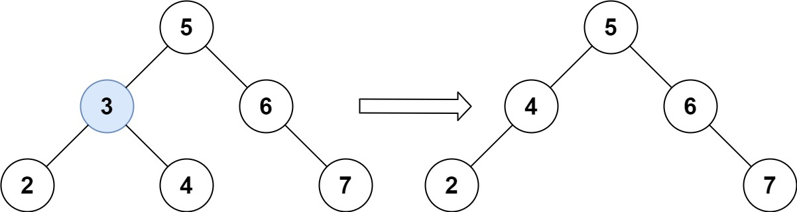
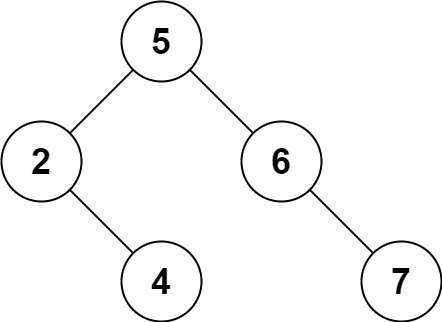

## Algorithm

[450. Delete Node in a BST](https://leetcode.com/problems/delete-node-in-a-bst)

### Description

Given a root node reference of a BST and a key, delete the node with the given key in the BST. Return the root node reference (possibly updated) of the BST.

Basically, the deletion can be divided into two stages:

- Search for a node to remove.
- If the node is found, delete the node.


Example 1:



```
Input: root = [5,3,6,2,4,null,7], key = 3
Output: [5,4,6,2,null,null,7]
Explanation: Given key to delete is 3. So we find the node with value 3 and delete it.
One valid answer is [5,4,6,2,null,null,7], shown in the above BST.
Please notice that another valid answer is [5,2,6,null,4,null,7] and it's also accepted.
```



Example 2:

```
Input: root = [5,3,6,2,4,null,7], key = 0
Output: [5,3,6,2,4,null,7]
Explanation: The tree does not contain a node with value = 0.
```

Example 3:

```
Input: root = [], key = 0
Output: []
```

Constraints:

- The number of nodes in the tree is in the range [0, 104].
- -105 <= Node.val <= 105
- Each node has a unique value.
- root is a valid binary search tree.
- -105 <= key <= 105


Follow up: Could you solve it with time complexity O(height of tree)?

### Solution

```java
/**
 * Definition for a binary tree node.
 * public class TreeNode {
 *     int val;
 *     TreeNode left;
 *     TreeNode right;
 *     TreeNode() {}
 *     TreeNode(int val) { this.val = val; }
 *     TreeNode(int val, TreeNode left, TreeNode right) {
 *         this.val = val;
 *         this.left = left;
 *         this.right = right;
 *     }
 * }
 */
class Solution {
    public TreeNode deleteNode(TreeNode root, int key) {
        if(root == null){
            return null;
        }else if(key < root.val){
            root.left=deleteNode(root.left,key);
        }else if(key > root.val){
            root.right=deleteNode(root.right,key);
        }else{
            // Case 1: When there is no child, we can set the value to null as we have to delete that
            // particular value
            if(root.left == null && root.right == null){
                root = null;
            }
            // Case 2: When there is one child
            else if(root.left == null){
                root = root.right;
            }
            else if(root.right == null){
                root = root.left;
            }
            // Case 3: When there are two children
            else {
                TreeNode temp = root;
                // Finding minimum element from right or
                // Find maximum element from left subtree
                TreeNode minNodeFromRight = minimumElement(temp.right);
                // here we are replacing current node with the minimum node from the right subtree
                root.val = minNodeFromRight.val;
                // deleting minimum node
                root.right = deleteNode(root.right, minNodeFromRight.val);
            }
        }
        return root;
    }
    // Get minimum element in binary search tree
    // we keep going on left as minimum will be on left
    public static TreeNode minimumElement(TreeNode root){
        if (root.left == null)
            return root;
        else
            return minimumElement(root.left);
    }
}
```

### Discuss

## Review


## Tip


## Share
