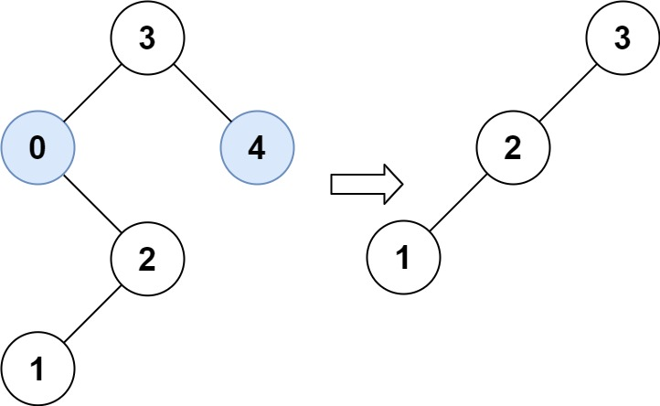

## Algorithm

[669. Trim a Binary Search Tree](https://leetcode.com/problems/trim-a-binary-search-tree/)

### Description

Given the root of a binary search tree and the lowest and highest boundaries as low and high, trim the tree so that all its elements lies in [low, high]. Trimming the tree should not change the relative structure of the elements that will remain in the tree (i.e., any node's descendant should remain a descendant). It can be proven that there is a unique answer.

Return the root of the trimmed binary search tree. Note that the root may change depending on the given bounds.

Example 1:


```
Input: root = [1,0,2], low = 1, high = 2
Output: [1,null,2]
```

Example 2:



```
Input: root = [3,0,4,null,2,null,null,1], low = 1, high = 3
Output: [3,2,null,1]
```

Constraints:

- The number of nodes in the tree is in the range [1, 104].
- 0 <= Node.val <= 104
- The value of each node in the tree is unique.
- root is guaranteed to be a valid binary search tree.
- 0 <= low <= high <= 104

### Solution

```java
/**
 * Definition for a binary tree node.
 * public class TreeNode {
 *     int val;
 *     TreeNode left;
 *     TreeNode right;
 *     TreeNode() {}
 *     TreeNode(int val) { this.val = val; }
 *     TreeNode(int val, TreeNode left, TreeNode right) {
 *         this.val = val;
 *         this.left = left;
 *         this.right = right;
 *     }
 * }
 */
class Solution {
    public TreeNode trimBST(TreeNode root, int low, int high) {
        if(root==null) return null;
        if(root.val<L) return trimBST(root.right,L,R);
        if(root.val>R) return trimBST(root.left,L,R);
        root.left = trimBST(root.left,L,R);
        root.right = trimBST(root.right,L,R);
        return root;
    }
}
```

### Discuss

## Review


## Tip


## Share
