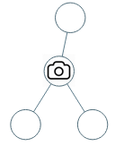
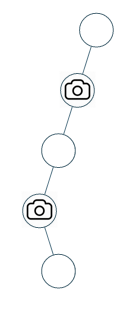

## Algorithm

[968. Binary Tree Cameras](https://leetcode.com/problems/binary-tree-cameras/)

### Description

You are given the root of a binary tree. We install cameras on the tree nodes where each camera at a node can monitor its parent, itself, and its immediate children.

Return the minimum number of cameras needed to monitor all nodes of the tree.


Example 1:



```
Input: root = [0,0,null,0,0]
Output: 1
Explanation: One camera is enough to monitor all nodes if placed as shown.
```

Example 2:



```
Input: root = [0,0,null,0,null,0,null,null,0]
Output: 2
Explanation: At least two cameras are needed to monitor all nodes of the tree. The above image shows one of the valid configurations of camera placement.
```

Constraints:

- The number of nodes in the tree is in the range [1, 1000].
- Node.val == 0

### Solution

```java
/**
 * Definition for a binary tree node.
 * public class TreeNode {
 *     int val;
 *     TreeNode left;
 *     TreeNode right;
 *     TreeNode() {}
 *     TreeNode(int val) { this.val = val; }
 *     TreeNode(int val, TreeNode left, TreeNode right) {
 *         this.val = val;
 *         this.left = left;
 *         this.right = right;
 *     }
 * }
 */
class Solution {
    int  res=0;
    public int minCameraCover(TreeNode root) {
        // 对根节点的状态做检验,防止根节点是无覆盖状态 .
        if(minCame(root)==0){
            res++;
        }
        return res;
    }
    /**
     节点的状态值：
       0 表示无覆盖
       1 表示 有摄像头
       2 表示有覆盖
    后序遍历，根据左右节点的情况,来判读 自己的状态
     */
    public int minCame(TreeNode root){
        if(root==null){
            // 空节点默认为 有覆盖状态，避免在叶子节点上放摄像头
            return 2;
        }
        int left=minCame(root.left);
        int  right=minCame(root.right);

        // 如果左右节点都覆盖了的话, 那么本节点的状态就应该是无覆盖,没有摄像头
        if(left==2&&right==2){
            //(2,2)
            return 0;
        }else if(left==0||right==0){
            // 左右节点都是无覆盖状态,那 根节点此时应该放一个摄像头
            // (0,0) (0,1) (0,2) (1,0) (2,0)
            // 状态值为 1 摄像头数 ++;
            res++;
            return 1;
        }else{
            // 左右节点的 状态为 (1,1) (1,2) (2,1) 也就是左右节点至少存在 1个摄像头，
            // 那么本节点就是处于被覆盖状态
            return 2;
        }
    }
}
```

### Discuss

## Review


## Tip


## Share
