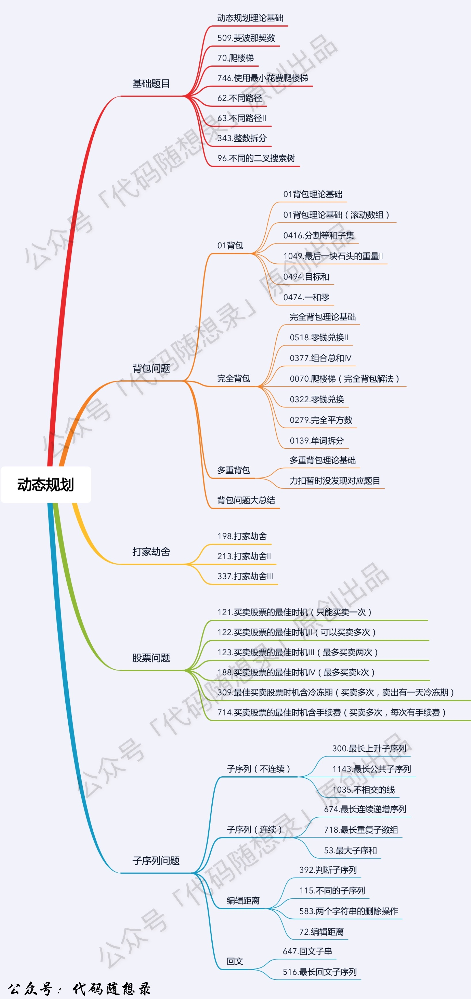

## Algorithm

[509. Fibonacci Number](https://leetcode.com/problems/fibonacci-number/)

### Description

The Fibonacci numbers, commonly denoted F(n) form a sequence, called the Fibonacci sequence, such that each number is the sum of the two preceding ones, starting from 0 and 1. That is,

```
F(0) = 0, F(1) = 1
F(n) = F(n - 1) + F(n - 2), for n > 1.
```

Given n, calculate F(n).


Example 1:

```
Input: n = 2
Output: 1
Explanation: F(2) = F(1) + F(0) = 1 + 0 = 1.
```

Example 2:

```
Input: n = 3
Output: 2
Explanation: F(3) = F(2) + F(1) = 1 + 1 = 2.
```

Example 3:

```
Input: n = 4
Output: 3
Explanation: F(4) = F(3) + F(2) = 2 + 1 = 3.
```

Constraints:

- 0 <= n <= 30

### Solution

```java
class Solution {
    public int fib(int n) {
        if (n < 2) return n;
        int a = 0, b = 1, c = 0;
        for (int i = 1; i < n; i++) {
            c = a + b;
            a = b;
            b = c;
        }
        return c;
    }
}
//非压缩状态的版本
class Solution {
    public int fib(int n) {
        if (n <= 1) return n;             
        int[] dp = new int[n + 1];
        dp[0] = 0;
        dp[1] = 1;
        for (int index = 2; index <= n; index++){
            dp[index] = dp[index - 1] + dp[index - 2];
        }
        return dp[n];
    }
}
```

### Discuss



对于动态规划问题，我将拆解为如下五步曲，这五步都搞清楚了，才能说把动态规划真的掌握了！

确定dp数组（dp table）以及下标的含义
确定递推公式
dp数组如何初始化
确定遍历顺序
举例推导dp数组

## Review


## Tip


## Share
