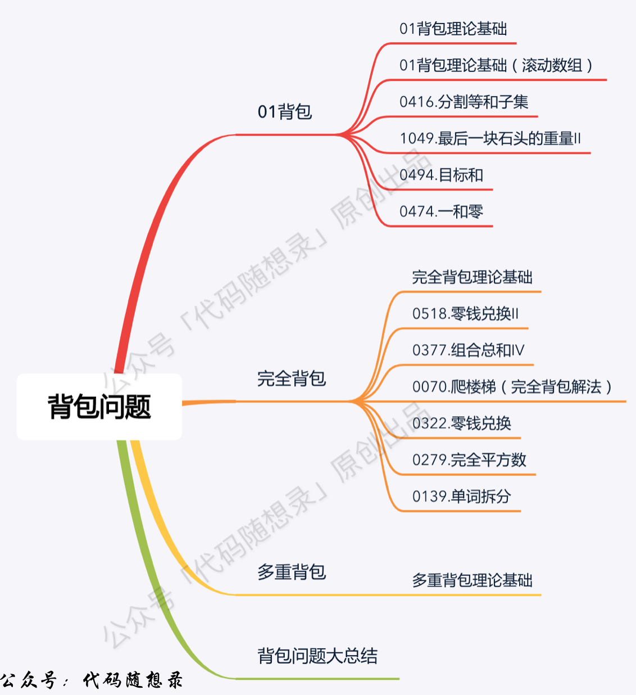

## Algorithm

[322. Coin Change](https://leetcode.com/problems/coin-change/)

### Description

You are given an integer array coins representing coins of different denominations and an integer amount representing a total amount of money.

Return the fewest number of coins that you need to make up that amount. If that amount of money cannot be made up by any combination of the coins, return -1.

You may assume that you have an infinite number of each kind of coin.

Example 1:

```
Input: coins = [1,2,5], amount = 11
Output: 3
Explanation: 11 = 5 + 5 + 1
```

Example 2:

```
Input: coins = [2], amount = 3
Output: -1
```

Example 3:

```
Input: coins = [1], amount = 0
Output: 0
```

Constraints:

- 1 <= coins.length <= 12
- 1 <= coins[i] <= 231 - 1
- 0 <= amount <= 104

### Solution

```java
class Solution {
    public int coinChange(int[] coins, int amount) {
        if(coins==null || coins.length==0 || amount<=0){
            return 0;
        }
        int[] dp = new int[amount + 1];
        for (int i = 1; i <= amount; i++) {
            dp[i] = Integer.MAX_VALUE;
            for (int j = 0; j < coins.length; j++) {
                if (coins[j] <= i && dp[i - coins[j]] != Integer.MAX_VALUE){
                    dp[i] = Integer.min(dp[i], 1 + dp[i - coins[j]]);
                }
            }
        }
        if (dp[amount] == Integer.MAX_VALUE){
            return -1;
        }else{
            return dp[amount];
        }
    }
}

class Solution {
    public int coinChange(int[] coins, int amount) {
        int max = Integer.MAX_VALUE;
        int[] dp = new int[amount + 1];
        //初始化dp数组为最大值
        for (int j = 0; j < dp.length; j++) {
            dp[j] = max;
        }
        //当金额为0时需要的硬币数目为0
        dp[0] = 0;
        for (int i = 0; i < coins.length; i++) {
            //正序遍历：完全背包每个硬币可以选择多次
            for (int j = coins[i]; j <= amount; j++) {
                //只有dp[j-coins[i]]不是初始最大值时，该位才有选择的必要
                if (dp[j - coins[i]] != max) {
                    //选择硬币数目最小的情况
                    dp[j] = Math.min(dp[j], dp[j - coins[i]] + 1);
                }
            }
        }
        return dp[amount] == max ? -1 : dp[amount];
    }
}
```

### Discuss



## Review


## Tip


## Share
