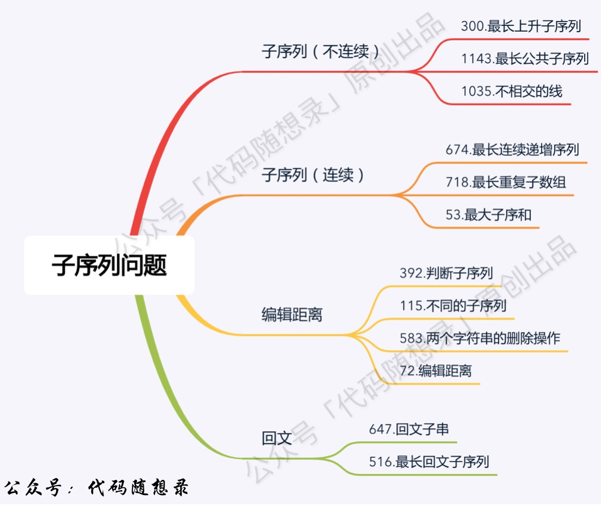

## Algorithm

[674. Longest Continuous Increasing Subsequence](https://leetcode.com/problems/longest-continuous-increasing-subsequence)

### Description

Given an unsorted array of integers nums, return the length of the longest continuous increasing subsequence (i.e. subarray). The subsequence must be strictly increasing.

A continuous increasing subsequence is defined by two indices l and r (l < r) such that it is [nums[l], nums[l + 1], ..., nums[r - 1], nums[r]] and for each l <= i < r, nums[i] < nums[i + 1].


Example 1:

```
Input: nums = [1,3,5,4,7]
Output: 3
Explanation: The longest continuous increasing subsequence is [1,3,5] with length 3.
Even though [1,3,5,7] is an increasing subsequence, it is not continuous as elements 5 and 7 are separated by element
4.
```

Example 2:

```
Input: nums = [2,2,2,2,2]
Output: 1
Explanation: The longest continuous increasing subsequence is [2] with length 1. Note that it must be strictly
increasing.
```

Constraints:

- 1 <= nums.length <= 104
- -109 <= nums[i] <= 109

### Solution

```java
class Solution {
    public int findLengthOfLCIS(int[] nums) {
        if(nums == null || nums.length == 0){
            return 0;
        }

        int n = nums.length;
        int[] dp = new int[n];

        int max = 1;
        dp[0] = 1;
        for(int i=1;i<n;i++){
            if(nums[i] > nums[i-1]){
                dp[i] = dp[i-1] + 1;
            }else{
                dp[i] = 1;
            }
            max = Math.max(max, dp[i]);
        }

        return max;
    }
}
```

### Discuss



## Review


## Tip


## Share
