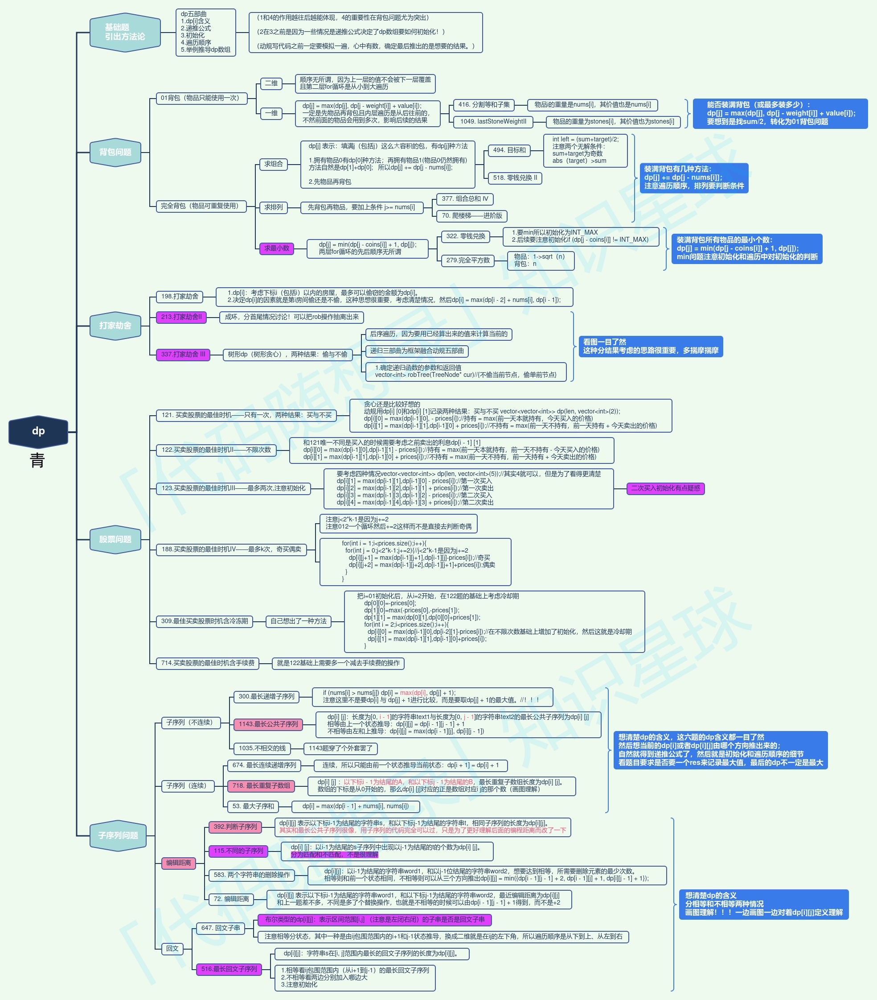

## Algorithm

[279. Perfect Squares](https://leetcode.com/problems/perfect-squares)

### Description

Given an integer n, return the least number of perfect square numbers that sum to n.

A perfect square is an integer that is the square of an integer; in other words, it is the product of some integer with itself. For example, 1, 4, 9, and 16 are perfect squares while 3 and 11 are not.


Example 1:

```
Input: n = 12
Output: 3
Explanation: 12 = 4 + 4 + 4.
```

Example 2:

```
Input: n = 13
Output: 2
Explanation: 13 = 4 + 9.
```

Constraints:

- 1 <= n <= 104


### Solution

```java
class Solution {
    // 版本一，先遍历物品, 再遍历背包
    public int numSquares(int n) {
        int max = Integer.MAX_VALUE;
        int[] dp = new int[n + 1];
        //初始化
        for (int j = 0; j <= n; j++) {
            dp[j] = max;
        }
      	//如果不想要寫for-loop填充數組的話，也可以用JAVA內建的Arrays.fill()函數。
      	//Arrays.fill(dp, Integer.MAX_VALUE);

        //当和为0时，组合的个数为0
        dp[0] = 0;
        // 遍历物品
        for (int i = 1; i * i <= n; i++) {
            // 遍历背包
            for (int j = i * i; j <= n; j++) {
                //if (dp[j - i * i] != max) {
                    dp[j] = Math.min(dp[j], dp[j - i * i] + 1);
                //}
		//不需要這個if statement，因爲在完全平方數這一題不會有"湊不成"的狀況發生（ 一定可以用"1"來組成任何一個n），故comment掉這個if statement。
            }
        }
        return dp[n];
    }
}

class Solution {
    // 版本二， 先遍历背包, 再遍历物品
    public int numSquares(int n) {
        int max = Integer.MAX_VALUE;
        int[] dp = new int[n + 1];
        // 初始化
        for (int j = 0; j <= n; j++) {
            dp[j] = max;
        }
        // 当和为0时，组合的个数为0
        dp[0] = 0;
        // 遍历背包
        for (int j = 1; j <= n; j++) {
            // 遍历物品
            for (int i = 1; i * i <= j; i++) {
                dp[j] = Math.min(dp[j], dp[j - i * i] + 1);
            }
        }
        return dp[n];
    }
}
```

### Discuss



## Review


## Tip


## Share
