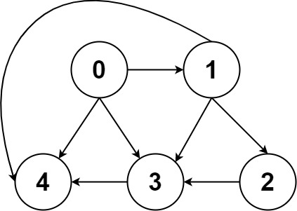

## Algorithm

[797. All Paths From Source to Target](https://leetcode.com/problems/all-paths-from-source-to-target/)

### Description

Given a directed acyclic graph (DAG) of n nodes labeled from 0 to n - 1, find all possible paths from node 0 to node n - 1 and return them in any order.

The graph is given as follows: graph[i] is a list of all nodes you can visit from node i (i.e., there is a directed edge from node i to node graph[i][j]).


Example 1:


```
Input: graph = [[1,2],[3],[3],[]]
Output: [[0,1,3],[0,2,3]]
Explanation: There are two paths: 0 -> 1 -> 3 and 0 -> 2 -> 3.
```

Example 2:



```
Input: graph = [[4,3,1],[3,2,4],[3],[4],[]]
Output: [[0,4],[0,3,4],[0,1,3,4],[0,1,2,3,4],[0,1,4]]
```

Constraints:

- n == graph.length
- 2 <= n <= 15
- 0 <= graph[i][j] < n
- graph[i][j] != i (i.e., there will be no self-loops).
- All the elements of graph[i] are unique.
- The input graph is guaranteed to be a DAG.

### Solution

```java
class Solution {
    List<List<Integer>> ans;		// 用来存放满足条件的路径
    List<Integer> cnt;		// 用来保存 dfs 过程中的节点值

    public void dfs(int[][] graph, int node) {
        if (node == graph.length - 1) {		// 如果当前节点是 n - 1，那么就保存这条路径
            ans.add(new ArrayList<>(cnt));
            return;
        }
        for (int index = 0; index < graph[node].length; index++) {
            int nextNode = graph[node][index];
            cnt.add(nextNode);
            dfs(graph, nextNode);
            cnt.remove(cnt.size() - 1);		// 回溯
        }
    }

    public List<List<Integer>> allPathsSourceTarget(int[][] graph) {
        ans = new ArrayList<>();
        cnt = new ArrayList<>();
        cnt.add(0);			// 注意，0 号节点要加入 cnt 数组中
        dfs(graph, 0);
        return ans;
    }
}
```

### Discuss

## Review


## Tip


## Share
