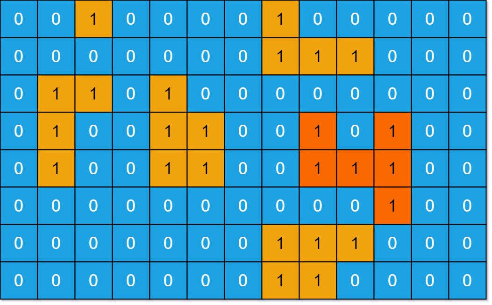

## Algorithm

[695. Max Area of Island](https://leetcode.com/problems/max-area-of-island/)

### Description

You are given an m x n binary matrix grid. An island is a group of 1's (representing land) connected 4-directionally (horizontal or vertical.) You may assume all four edges of the grid are surrounded by water.

The area of an island is the number of cells with a value 1 in the island.

Return the maximum area of an island in grid. If there is no island, return 0.


Example 1:



```
Input: grid = [[0,0,1,0,0,0,0,1,0,0,0,0,0],[0,0,0,0,0,0,0,1,1,1,0,0,0],[0,1,1,0,1,0,0,0,0,0,0,0,0],[0,1,0,0,1,1,0,0,1,0,1,0,0],[0,1,0,0,1,1,0,0,1,1,1,0,0],[0,0,0,0,0,0,0,0,0,0,1,0,0],[0,0,0,0,0,0,0,1,1,1,0,0,0],[0,0,0,0,0,0,0,1,1,0,0,0,0]]
Output: 6
Explanation: The answer is not 11, because the island must be connected 4-directionally.
```

Example 2:

```
Input: grid = [[0,0,0,0,0,0,0,0]]
Output: 0
```

Constraints:

- m == grid.length
- n == grid[i].length
- 1 <= m, n <= 50
- grid[i][j] is either 0 or 1.

### Solution

```java
// DFS
class Solution {
    int[][] dir = {
        {0, 1}, //right
        {1, 0}, //down
        {0, -1}, //left
        {-1, 0} //up
    };
    boolean visited[][];
    int count;
    public int maxAreaOfIsland(int[][] grid) {
        int res = 0;
        visited = new boolean[grid.length][grid[0].length];
        for(int i = 0; i < grid.length; i++){
            for(int j = 0; j < grid[0].length; j++){
                if(visited[i][j] == false && grid[i][j] == 1){
                    count = 0;
                    dfs(grid, i, j);
                    res = Math.max(res, count);
                }
            }
        }
        return res;
    }
    private void dfs(int[][] grid, int x, int y){
        if(visited[x][y] == true || grid[x][y] == 0)
            return;

        visited[x][y] = true;
        count++;

        for(int i = 0; i < 4; i++){
            int nextX = x + dir[i][0];
            int nextY = y + dir[i][1];

            if(nextX < 0 || nextY < 0 || nextX >= grid.length || nextY >= grid[0].length)
                continue;
            dfs(grid, nextX, nextY);
        }
    }
}

//BFS
class Solution {
    int[][] dir = {
        {0, 1}, {1, 0}, {0, -1}, {-1, 0}
    };

    int count;
    boolean visited[][];

    public int maxAreaOfIsland(int[][] grid) {
        int res = 0;
        visited = new boolean[grid.length][grid[0].length];

        for(int i = 0; i < grid.length; i++){
            for(int j = 0; j < grid[0].length; j++){
                if(visited[i][j] == false && grid[i][j] == 1){
                    count = 0;
                    bfs(grid, i, j);
                    res = Math.max(res, count);
                }
            }
        }
        return res;
    }
    private void bfs(int[][] grid, int x, int y){
        Queue<Integer> que = new LinkedList<>();
        que.offer(x);
        que.offer(y);
        visited[x][y] = true;
        count++;

        while(!que.isEmpty()){
            int currX = que.poll();
            int currY = que.poll();

            for(int i = 0; i < 4; i++){
                int nextX = currX + dir[i][0];
                int nextY = currY + dir[i][1];

                if(nextX < 0 || nextY < 0 || nextX >= grid.length || nextY >= grid[0].length)
                    continue;
                if(visited[nextX][nextY] == false && grid[nextX][nextY] == 1){
                    que.offer(nextX);
                    que.offer(nextY);
                    visited[nextX][nextY] = true;
                    count++;
                }
            }
        }
    }
}
```

### Discuss

## Review


## Tip


## Share
