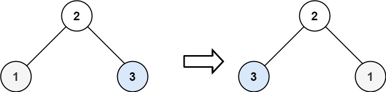

## Algorithm

[226. Invert Binary Tree](https://leetcode.com/problems/invert-binary-tree/)

### Description

Given the root of a binary tree, invert the tree, and return its root.

Example 1:


```
Input: root = [4,2,7,1,3,6,9]
Output: [4,7,2,9,6,3,1]
```

Example 2:



```
Input: root = [2,1,3]
Output: [2,3,1]
```

Example 3:

```
Input: root = []
Output: []
```

Constraints:

- The number of nodes in the tree is in the range [0, 100].
- -100 <= Node.val <= 100

### Solution

```java
/**
 * Definition for a binary tree node.
 * public class TreeNode {
 *     int val;
 *     TreeNode left;
 *     TreeNode right;
 *     TreeNode() {}
 *     TreeNode(int val) { this.val = val; }
 *     TreeNode(int val, TreeNode left, TreeNode right) {
 *         this.val = val;
 *         this.left = left;
 *         this.right = right;
 *     }
 * }
 */
class Solution {
    public TreeNode invertTree(TreeNode root) {
        if(root==null){
            return null;
        }
        TreeNode temp = root.left;
        root.left = invertTree(root.right);
        root.right = invertTree(temp);
        return root;
    }
}
```

### Discuss

## Review


## Tip


## Share
