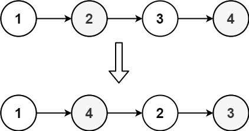
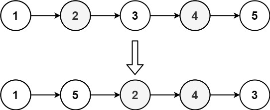

## Algorithm

[143. Reorder List](https://leetcode.com/problems/reorder-list/description/)

### Description

You are given the head of a singly linked-list. The list can be represented as:

```
L0 → L1 → … → Ln - 1 → Ln
```

Reorder the list to be on the following form:

```
L0 → Ln → L1 → Ln - 1 → L2 → Ln - 2 → …
```

You may not modify the values in the list's nodes. Only nodes themselves may be changed.


Example 1:



```
Input: head = [1,2,3,4]
Output: [1,4,2,3]
```

Example 2:



```
Input: head = [1,2,3,4,5]
Output: [1,5,2,4,3]
```

Constraints:

- The number of nodes in the list is in the range [1, 5 * 104].
- 1 <= Node.val <= 1000

### Solution

```java
/**
 * Definition for singly-linked list.
 * public class ListNode {
 *     int val;
 *     ListNode next;
 *     ListNode() {}
 *     ListNode(int val) { this.val = val; }
 *     ListNode(int val, ListNode next) { this.val = val; this.next = next; }
 * }
 */
class Solution {
    public void reorderList(ListNode head) {
        if(head==null||head.next==null){
            return;
        }

        // Find the middle node
        ListNode slow = head, fast = head.next;
        while (fast != null && fast.next != null) {
            slow = slow.next;
            fast = fast.next.next;
        }

        // Reverse the second half
        ListNode head2 = reverse(slow.next);
        slow.next = null;

        // Intertwine the two halves
        merge(head, head2);
    }

    private void merge(ListNode head1, ListNode head2) {
        while (head2 != null) {
            ListNode next = head1.next;
            head1.next = head2;
            head1 = head2;
            head2 = next;
        }
    }

    private ListNode reverse(ListNode node){
        ListNode pre = null, now = node;
        while(now!=null){
            ListNode next = now.next;
            now.next = pre;
            pre = now;
            now = next;
        }
        return pre;
    }
}
```

### Discuss

## Review


## Tip


## Share
