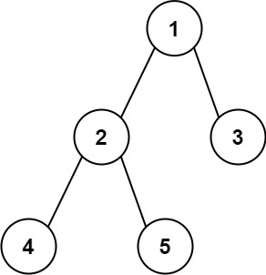

## Algorithm

[543. Diameter of Binary Tree](https://leetcode.com/problems/diameter-of-binary-tree/)

### Description

Given the root of a binary tree, return the length of the diameter of the tree.

The diameter of a binary tree is the length of the longest path between any two nodes in a tree. This path may or may not pass through the root.

The length of a path between two nodes is represented by the number of edges between them.

Example 1:



```
Input: root = [1,2,3,4,5]
Output: 3
Explanation: 3 is the length of the path [4,2,1,3] or [5,2,1,3].
```

Example 2:

```
Input: root = [1,2]
Output: 1
```

Constraints:

- The number of nodes in the tree is in the range [1, 104].
- -100 <= Node.val <= 100

### Solution

```java
class Solution {
    private int max = 0;

    public int diameterOfBinaryTree(TreeNode root) {
        nodes(root);
        return max;
    }

    private int nodes(TreeNode root){
        if(root == null){
            return 0;
        }
        int len1 = nodes(root.left) + 1;
        int len2 = nodes(root.right) + 1;
        max = Math.max(max, len1 + len2 -2);
        return len1 > len2 ? len1 : len2;
    }
}
```

### Discuss

## Review


## Tip


## Share
