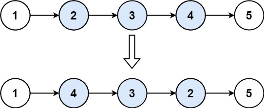
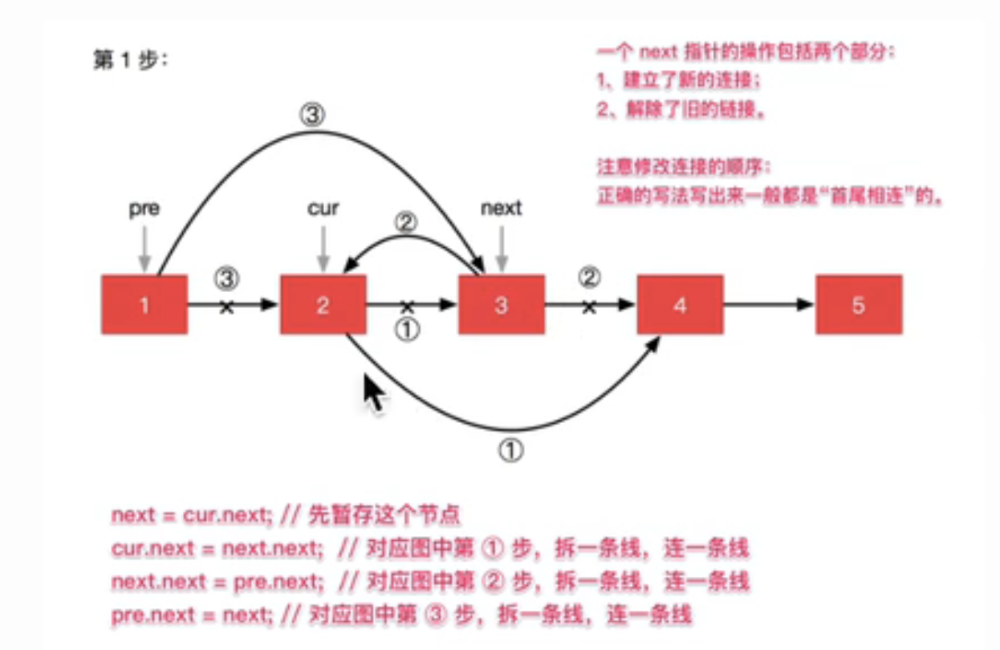
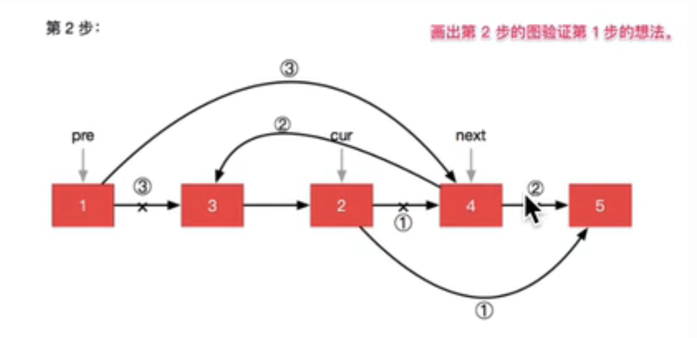

## Algorithm

[92. Reverse Linked List II](https://leetcode.com/problems/reverse-linked-list-ii/description/)

### Description

Given the head of a singly linked list and two integers left and right where left <= right, reverse the nodes of the list from position left to position right, and return the reversed list.

Example 1:



```
Input: head = [1,2,3,4,5], left = 2, right = 4
Output: [1,4,3,2,5]
```

Example 2:

```
Input: head = [5], left = 1, right = 1
Output: [5]
```

Constraints:

- The number of nodes in the list is n.
- 1 <= n <= 500
- -500 <= Node.val <= 500
- 1 <= left <= right <= n

Follow up: Could you do it in one pass?

### Solution

```java
class Solution {
    public ListNode reverseBetween(ListNode head, int left, int right) {
        ListNode dummy = new ListNode(0);
        dummy.next = head;

        ListNode pre = dummy;
        ListNode now = head;
        for(int i = 1; i < left;i++){
            pre = pre.next;
            now = now.next;
        }
        // reverse
        for (int i = 0; i < right - left; i ++ ) {
            ListNode next = now.next;
            now.next = next.next;
            next.next = pre.next;
            pre.next = next;
        }
        return dummy.next;
    }
}
```





### Discuss

## Review


## Tip


## Share
