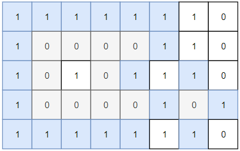
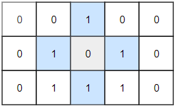

## Algorithm

[1254. Number of Closed Islands](https://leetcode.com/problems/number-of-closed-islands/description/)

### Description

Given a 2D grid consists of 0s (land) and 1s (water).  An island is a maximal 4-directionally connected group of 0s and a closed island is an island totally (all left, top, right, bottom) surrounded by 1s.

Return the number of closed islands.

Example 1:



```
Input: grid = [[1,1,1,1,1,1,1,0],[1,0,0,0,0,1,1,0],[1,0,1,0,1,1,1,0],[1,0,0,0,0,1,0,1],[1,1,1,1,1,1,1,0]]
Output: 2
Explanation:
Islands in gray are closed because they are completely surrounded by water (group of 1s).
```

Example 2:



```
Input: grid = [[0,0,1,0,0],[0,1,0,1,0],[0,1,1,1,0]]
Output: 1
```

Example 3:

```
Input: grid = [[1,1,1,1,1,1,1],
               [1,0,0,0,0,0,1],
               [1,0,1,1,1,0,1],
               [1,0,1,0,1,0,1],
               [1,0,1,1,1,0,1],
               [1,0,0,0,0,0,1],
               [1,1,1,1,1,1,1]]
Output: 2
```

Constraints:

- 1 <= grid.length, grid[0].length <= 100
- 0 <= grid[i][j] <=1


### Solution

```java
class Solution {
    public int closedIsland(int[][] grid) {
        if(grid == null || grid.length == 0)
            return 0;

        int result = 0;
        int rows = grid.length, cols = grid[0].length;

        //dfs islands from sides into water
        for(int i = 0; i < cols; i++) {
            if(grid[0][i] == 0) dfs(grid, 0, i, rows, cols);
            if(grid[rows - 1][i] == 0) dfs(grid, rows - 1, i, rows, cols);
        }
        for(int i = 0; i < rows; i++) {
            if(grid[i][0] == 0) dfs(grid, i, 0, rows, cols);
            if(grid[i][cols - 1] == 0) dfs(grid, i, cols - 1, rows, cols);
        }

        for(int i = 0; i < rows; i++) {
            for(int j = 0; j < cols; j++) {
                if(grid[i][j] == 0) {
                    dfs(grid, i, j, rows, cols);
                    result++;
                }
            }
        }

        return result;
    }
    private void dfs(int[][] grid, int x, int y, int rows, int cols) {
        if(x < 0 || x >= rows || y < 0 || y >= cols || grid[x][y] == 1)
            return;

        grid[x][y] = 1;
        dfs(grid, x + 1, y, rows, cols);
        dfs(grid, x, y + 1, rows, cols);
        dfs(grid, x - 1, y, rows, cols);
        dfs(grid, x, y - 1, rows, cols);
    }
}
```

### Discuss

## Review


## Tip


## Share
