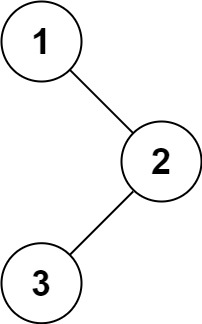

## Algorithm

[94. Binary Tree Inorder Traversal](https://leetcode.com/problems/binary-tree-inorder-traversal/)

### Description

Given the root of a binary tree, return the inorder traversal of its nodes' values.

Example 1:



```
Input: root = [1,null,2,3]
Output: [1,3,2]
```

Example 2:

```
Input: root = []
Output: []
```

Example 3:

```
Input: root = [1]
Output: [1]
```

Constraints:

- The number of nodes in the tree is in the range [0, 100].
- -100 <= Node.val <= 100


Follow up: Recursive solution is trivial, could you do it iteratively?

### Solution

```java
class Solution {
    public List<Integer> inorderTraversal(TreeNode root) {
        List<Integer> result = new ArrayList<>();
        Stack<TreeNode> stack = new Stack<>();
        while(!stack.isEmpty() || root != null){
            while(root != null){
                stack.push(root);
                root = root.left;
            }
            root = stack.pop();
            result.add(root.val);
            root = root.right;
        }
        return result;
    }

    public void inorder(TreeNode root, List<Integer> result){
        if(root == null){
            return;
        }
        inorder(root.left, result);
        result.add(root.val);
        inorder(root.right, result);
    }
}
```

### Discuss

## Review


## Tip


## Share
