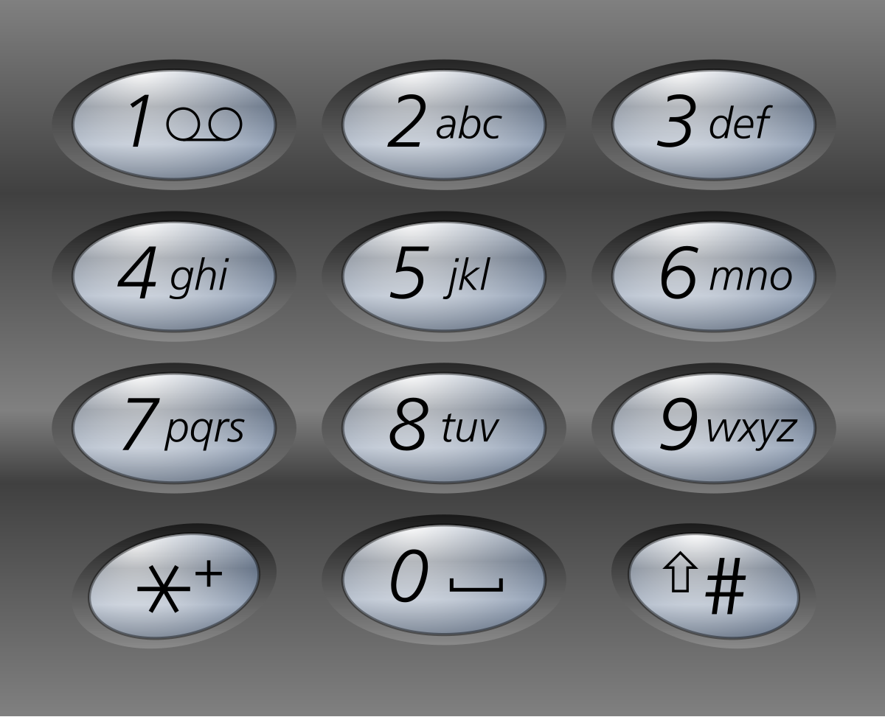

## Algorithm

[17. Letter Combinations of a Phone Number](https://leetcode.com/problems/letter-combinations-of-a-phone-number/?envType=study-plan-v2&envId=top-100-liked)

### Description

Given a string containing digits from 2-9 inclusive, return all possible letter combinations that the number could represent. Return the answer in any order.

A mapping of digits to letters (just like on the telephone buttons) is given below. Note that 1 does not map to any letters.



Example 1:

```
Input: digits = "23"
Output: ["ad","ae","af","bd","be","bf","cd","ce","cf"]
```

Example 2:

```
Input: digits = ""
Output: []
```

Example 3:

```
Input: digits = "2"
Output: ["a","b","c"]
```

Constraints:

- 0 <= digits.length <= 4
- digits[i] is a digit in the range ['2', '9'].


### Solution

```java
class Solution {
    public List<String> letterCombinations(String digits) {
        List<String> list = new LinkedList<>();
        if(digits == null || digits.length() == 0) {
            return list;
        }
        char[][] map = {{},{},{'a','b','c'},{'d','e','f'},{'g','h','i'},{'j','k','l'},{'m','n','o'},{'p','q','r','s'},{'t','u','v'},{'w','x','y','z'}};
        backtrack(digits,list,map,new StringBuilder(),0);
        return list;
    }
    private void backtrack(String digits, List<String> list, char[][] map, StringBuilder result, int start){
        if(start == digits.length()){
            list.add(new String(result));
            return;
        }
        int num = digits.charAt(start) - '0';
        for(int i = 0;i< map[num].length;i++){
            result.append(map[num][i]);
            backtrack(digits, list, map, result, start+1);
            result.deleteCharAt(result.length() - 1);
        }
    }
}
```

### Discuss

## Review


## Tip


## Share
