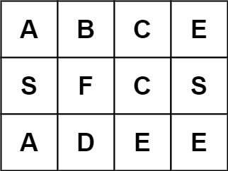

## Algorithm

[79. Word Search](https://leetcode.com/problems/word-search)

### Description

Given an m x n grid of characters board and a string word, return true if word exists in the grid.

The word can be constructed from letters of sequentially adjacent cells, where adjacent cells are horizontally or vertically neighboring. The same letter cell may not be used more than once.


Example 1:


```
Input: board = [["A","B","C","E"],["S","F","C","S"],["A","D","E","E"]], word = "ABCCED"
Output: true
```

Example 2:


```
Input: board = [["A","B","C","E"],["S","F","C","S"],["A","D","E","E"]], word = "SEE"
Output: true
```

Example 3:



```
Input: board = [["A","B","C","E"],["S","F","C","S"],["A","D","E","E"]], word = "ABCB"
Output: false
```

Constraints:

- m == board.length
- n = board[i].length
- 1 <= m, n <= 6
- 1 <= word.length <= 15
- board and word consists of only lowercase and uppercase English letters.

Follow up: Could you use search pruning to make your solution faster with a larger board?

### Solution

```java
class Solution {
    int[][] dirs={{1,0},{-1,0},{0,1},{0,-1}};
    public boolean exist(char[][] board, String word) {
        if (board==null ||board.length==0||board[0].length==0) return false;
        int m=board.length,n=board[0].length;
        boolean[][] visited=new boolean[m][n];
        for (int i=0;i< m;i++){
            for (int j=0;j<n;j++){               
                if (dfs(board,visited,i,j,0,word)){
                    return true;
                }              
            }
        }
        return false;
    }
    private boolean dfs(char[][] board, boolean[][] visited, int x, int y, int i, String word){         
        int m=board.length,n=board[0].length;   
        if (i==word.length()) return true;

        if(x<0||x>=m||y<0||y>=n) return false;
        if(visited[x][y]) return false;
        if(board[x][y]!=word.charAt(i)) return false;

        visited[x][y]=true;
        for (int[] dir: dirs){
            int x1=x+dir[0], y1=y+dir[1];
            if (dfs(board, visited, x1, y1, i+1, word)){
                return true;
            }
        }
        visited[x][y]=false;
        return false;                                                                          
    }
}
```

### Discuss

## Review


## Tip


## Share
