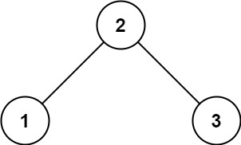
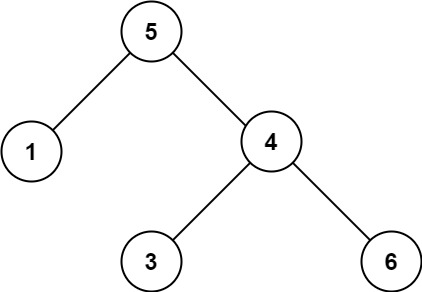

## Algorithm

[98. Validate Binary Search Tree](https://leetcode.com/problems/validate-binary-search-tree)

### Description

Given the root of a binary tree, determine if it is a valid binary search tree (BST).

A valid BST is defined as follows:

- The left subtree of a node contains only nodes with keys less than the node's key.
- The right subtree of a node contains only nodes with keys greater than the node's key.
- Both the left and right subtrees must also be binary search trees.

Example 1:



```
Input: root = [2,1,3]
Output: true
```

Example 2:



```
Input: root = [5,1,4,null,null,3,6]
Output: false
Explanation: The root node's value is 5 but its right child's value is 4.
```

Constraints:

- The number of nodes in the tree is in the range [1, 104].
- -231 <= Node.val <= 231 - 1

### Solution

```java
class Solution {
    public boolean isValidBST(TreeNode root) {
        if(root==null){
            return true;
        }
        return dfs(root,Long.MIN_VALUE,Long.MAX_VALUE);
    }

    boolean dfs(TreeNode root,long min,long max){
        // 当前节点为空直接返回true
        if(root == null){
            return true;
        }
        // 当前节点比min或者left节点小，或者当前节点比right节点大，返回false
        if(root.val<=min||root.val>=max){
            return false;
        }
        // 递归执行(left，min, 根结点) &&(right，根结点, max)
        return dfs(root.left,min,(int)root.val)&&
            dfs(root.right,(int)root.val,max);
    }
}
```

### Discuss

1. 单独写个函数 dfs(root,Long.MIN_VALUE,Long.MAX_VALUE);
2. 为空false,小小大大false,左右继续递归

## Review


## Tip


## Share
