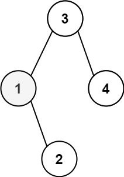
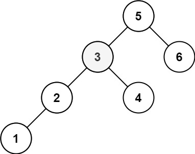

## Algorithm

[230. Kth Smallest Element in a BST](https://leetcode.com/problems/kth-smallest-element-in-a-bst)

### Description

Given the root of a binary search tree, and an integer k, return the kth smallest value (1-indexed) of all the values of the nodes in the tree.

Example 1:



```
Input: root = [3,1,4,null,2], k = 1
Output: 1
```

Example 2:



```
Input: root = [5,3,6,2,4,null,null,1], k = 3
Output: 3
```

Constraints:

- The number of nodes in the tree is n.
- 1 <= k <= n <= 104
- 0 <= Node.val <= 104

Follow up: If the BST is modified often (i.e., we can do insert and delete operations) and you need to find the kth smallest frequently, how would you optimize?

### Solution

```java
class Solution {
    public int kthSmallest(TreeNode root, int k) {
        Stack<TreeNode> stack = new Stack<TreeNode>();
        while (true) {
            while (root != null) {
                stack.push(root);
                root = root.left;
            }
            if (stack.isEmpty()) {
                break;
            }
            TreeNode node = stack.pop();
            if (--k == 0) {
                return node.val;
            }
            root = node.right;
        }
        return 0;
    }
}
```

中序遍历

```java
class Solution {
    public List<Integer> inorderTraversal(TreeNode root) {
        List<Integer> result = new ArrayList<>();
        Stack<TreeNode> stack = new Stack<>();
        while(!stack.isEmpty() || root != null){
            while(root != null){
                stack.push(root);
                root = root.left;
            }
            root = stack.pop();
            result.add(root.val);
            root = root.right;
        }
        return result;
    }

    public void inorder(TreeNode root, List<Integer> result){
        if(root == null){
            return;
        }
        inorder(root.left, result);
        result.add(root.val);
        inorder(root.right, result);
    }
}
```

### Discuss

## Review


## Tip


## Share
