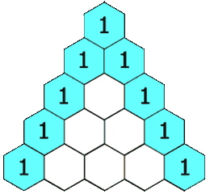

## Algorithm

[118. Pascal's Triangle](https://leetcode.com/problems/pascals-triangle/description)

### Description

Given an integer numRows, return the first numRows of Pascal's triangle.

In Pascal's triangle, each number is the sum of the two numbers directly above it as shown:

Example 1:



```
Input: numRows = 5
Output: [[1],[1,1],[1,2,1],[1,3,3,1],[1,4,6,4,1]]
```

Example 2:

```
Input: numRows = 1
Output: [[1]]
```

Constraints:

- 1 <= numRows <= 30

### Solution

```java
class Solution {
    public List<List<Integer>> generate(int numRows) {
        List<List<Integer>> lists= new ArrayList<>();
        if(numRows==0) {
            return lists;
        }
        if(numRows>=1) {
            List<Integer> list = new ArrayList<>();
            list.add(1);
            lists.add(list);
        }
        if(numRows>=2) {
            List<Integer> list = new ArrayList<>();
            list.add(1);
            list.add(1);
            lists.add(list);
        }
        if(numRows>=3){
            for(int j =3;j<=numRows;j++){
                List<Integer> list = new ArrayList<>();
                List<Integer> pre = lists.get(lists.size()-1);
                list.add(1);
                for(int i=0; i<pre.size()-1; i++){
                    int num = pre.get(i) + pre.get(i+1);
                    list.add(num);
                }
                list.add(1);
                lists.add(list);
            }
        }
        return lists;
    }
}
```

### Discuss

## Review


## Tip


## Share
