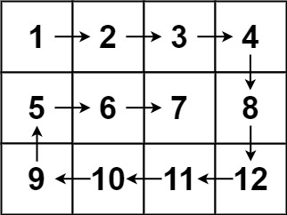

## Algorithm

[54. 螺旋矩阵](https://leetcode.cn/problems/spiral-matrix/description/?envType=study-plan-v2&envId=top-100-liked)

### Description

给你一个 m 行 n 列的矩阵 matrix ，请按照 顺时针螺旋顺序 ，返回矩阵中的所有元素。

示例 1：


```
输入：matrix = [[1,2,3],[4,5,6],[7,8,9]]
输出：[1,2,3,6,9,8,7,4,5]
```

示例 2：



```
输入：matrix = [[1,2,3,4],[5,6,7,8],[9,10,11,12]]
输出：[1,2,3,4,8,12,11,10,9,5,6,7]
```

提示：

- m == matrix.length
- n == matrix[i].length
- 1 <= m, n <= 10
- -100 <= matrix[i][j] <= 100

### Solution

```java
class Solution {
    public List<Integer> spiralOrder(int[][] matrix) {
        List<Integer> result = new ArrayList<>();
        int rowBegin = 0;
        int rowEnd = matrix.length - 1;
        int colBegin = 0;
        int colEnd = matrix[0].length - 1;
        while (rowBegin <= rowEnd && colBegin <= colEnd) {
            for (int j = colBegin; j <= colEnd; j++) {
                result.add(matrix[rowBegin][j]);
            }
            rowBegin++;
            for (int i = rowBegin; i <= rowEnd; i++) {
                result.add(matrix[i][colEnd]);
            }
            colEnd--;
            if (rowBegin <= rowEnd) {
                for (int j = colEnd; j >= colBegin; j--) {
                    result.add(matrix[rowEnd][j]);
                }
            }
            rowEnd--;
            if (colBegin <= colEnd) {
                for (int i = rowEnd; i >= rowBegin; i--) {
                    result.add(matrix[i][colBegin]);
                }
            }
            colBegin++;
        }
        return result;
    }
}
```

### Discuss

## Review


## Tip


## Share
