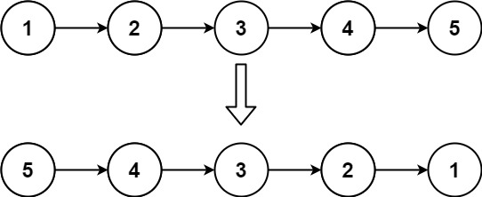

## Algorithm

[206. 反转链表](https://leetcode.cn/problems/reverse-linked-list/description/?envType=study-plan-v2&envId=top-100-liked)

### Description

给你单链表的头节点 head ，请你反转链表，并返回反转后的链表。

示例 1：



```
输入：head = [1,2,3,4,5]
输出：[5,4,3,2,1]
```

示例 2：


```
输入：head = [1,2]
输出：[2,1]
```

示例 3：

```
输入：head = []
输出：[]
```

提示：

- 链表中节点的数目范围是 [0, 5000]
- -5000 <= Node.val <= 5000


进阶：链表可以选用迭代或递归方式完成反转。你能否用两种方法解决这道题？

### Solution

```java
class Solution {
    public ListNode reverseList(ListNode head) {
        ListNode pre = null;
        ListNode now = head;
        while (now != null) {
            ListNode next = now.next;
            now.next = pre;
            pre = now;
            now = next;
        }
        return pre;
    }
}
```

### Discuss

## Review


## Tip


## Share
