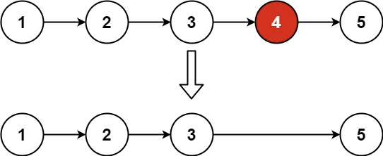

## Algorithm

[19. 删除链表的倒数第 N 个结点](https://leetcode.cn/problems/remove-nth-node-from-end-of-list/description/?envType=study-plan-v2&envId=top-100-liked)

### Description

给你一个链表，删除链表的倒数第 n 个结点，并且返回链表的头结点。

示例 1：



```
输入：head = [1,2,3,4,5], n = 2
输出：[1,2,3,5]
```

示例 2：

```
输入：head = [1], n = 1
输出：[]
```

示例 3：

```
输入：head = [1,2], n = 1
输出：[1]
```

提示：

- 链表中结点的数目为 sz
- 1 <= sz <= 30
- 0 <= Node.val <= 100
- 1 <= n <= sz

进阶：你能尝试使用一趟扫描实现吗？

### Solution

```java
class Solution {
    public ListNode removeNthFromEnd(ListNode head, int n) {
        ListNode fast = head;
        ListNode result = new ListNode(0);
        result.next = head;
        ListNode slow = result;
        while (fast != null) {
            fast = fast.next;
            if (n-- <= 0) {
                slow = slow.next;
            }
        }
        slow.next = slow.next.next;
        return result.next;
    }
}
```

### Discuss

## Review


## Tip


## Share
