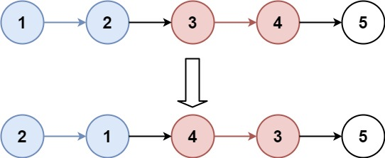
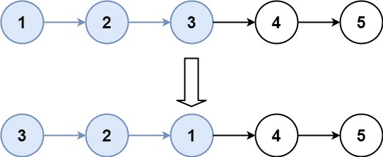

## Algorithm

[25. K 个一组翻转链表](https://leetcode.cn/problems/reverse-nodes-in-k-group/description/?envType=study-plan-v2&envId=top-100-liked)

### Description

给你链表的头节点 head ，每 k 个节点一组进行翻转，请你返回修改后的链表。

k 是一个正整数，它的值小于或等于链表的长度。如果节点总数不是 k 的整数倍，那么请将最后剩余的节点保持原有顺序。

你不能只是单纯的改变节点内部的值，而是需要实际进行节点交换。

示例 1：



```
输入：head = [1,2,3,4,5], k = 2
输出：[2,1,4,3,5]
```

示例 2：



```
输入：head = [1,2,3,4,5], k = 3
输出：[3,2,1,4,5]
```

提示：
- 链表中的节点数目为 n
- 1 <= k <= n <= 5000
- 0 <= Node.val <= 1000

进阶：你可以设计一个只用 O(1) 额外内存空间的算法解决此问题吗？

### Solution

```java
class Solution {
    public ListNode reverseKGroup(ListNode head, int k) {
        ListNode start = head;
        ListNode end = head;
        for(int i=0;i<k;i++){
            if(end == null){
                return head;
            }
            end = end.next;
        }
        ListNode newHead = reverse(start, end);
        start.next = reverseKGroup(end, k);
        return newHead;
    }

    public ListNode reverse(ListNode start, ListNode end){
        ListNode pre = null;
        ListNode now = start;
        while(now != end){
            ListNode next = now.next;
            now.next = pre;
            pre = now;
            now = next;
        }
        return pre;
    }
}
```

### Discuss

## Review


## Tip


## Share
