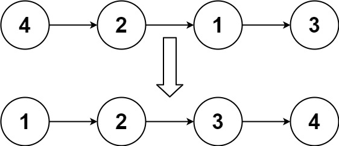
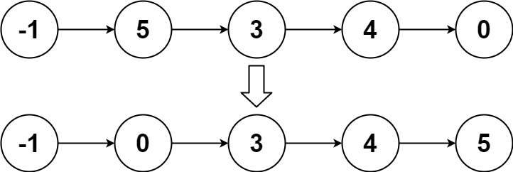

## Algorithm

[148. 排序链表](https://leetcode.cn/problems/sort-list/description/?envType=study-plan-v2&envId=top-100-liked)

### Description

给你链表的头结点 head ，请将其按 升序 排列并返回 排序后的链表 。

示例 1：



```
输入：head = [4,2,1,3]
输出：[1,2,3,4]
```

示例 2：



```
输入：head = [-1,5,3,4,0]
输出：[-1,0,3,4,5]
```

示例 3：

```
输入：head = []
输出：[]
```

提示：

- 链表中节点的数目在范围 [0, 5 * 104] 内
- -105 <= Node.val <= 105


进阶：你可以在 O(n log n) 时间复杂度和常数级空间复杂度下，对链表进行排序吗？

### Solution

```java
class Solution {
    public ListNode sortList(ListNode head) {
        List<ListNode> list = new ArrayList<>();
        while (head != null) {
            list.add(new ListNode(head.val));
            head = head.next;
        }
        Collections.sort(list, new Comparator<ListNode>() {
            @Override
            public int compare(ListNode o1, ListNode o2) {
                return o1.val - o2.val;
            }
        });

        ListNode dummy = new ListNode(0);
        ListNode current = dummy;
        for (ListNode node : list) {
            current.next = node;
            current = current.next;
        }
        return dummy.next;
    }
}
```

### Discuss

## Review


## Tip


## Share
