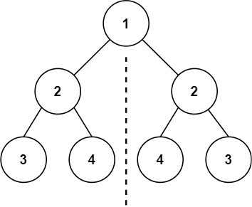
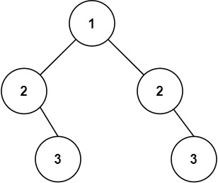

## Algorithm

[101. 对称二叉树](https://leetcode.cn/problems/symmetric-tree/description/?envType=study-plan-v2&envId=top-100-liked)

### Description

给你一个二叉树的根节点 root ， 检查它是否轴对称。

示例 1：



```
输入：root = [1,2,2,3,4,4,3]
输出：true
```

示例 2：



```
输入：root = [1,2,2,null,3,null,3]
输出：false
```

提示：

- 树中节点数目在范围 [1, 1000] 内
- -100 <= Node.val <= 100

进阶：你可以运用递归和迭代两种方法解决这个问题吗？

### Solution

```java
class Solution {
    public boolean isSymmetric(TreeNode root) {
        if(root == null){
            return true;
        }
        return symmetric(root.left, root.right);
    }

    public boolean symmetric(TreeNode left, TreeNode right){
        if(left == null && right == null){
            return true;
        }
        if(left == null && right != null){
            return false;
        }
        if(left != null && right == null){
            return false;
        }
        if(left.val != right.val){
            return false;
        }
        return symmetric(left.left, right.right) && symmetric(left.right, right.left);
    }
}
```

### Discuss

## Review


## Tip


## Share
