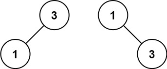

## Algorithm

[108. 将有序数组转换为二叉搜索树](https://leetcode.cn/problems/convert-sorted-array-to-binary-search-tree/description/?envType=study-plan-v2&envId=top-100-liked)

### Description

给你一个整数数组 nums ，其中元素已经按 升序 排列，请你将其转换为一棵 平衡 二叉搜索树。

示例 1：


```
输入：nums = [-10,-3,0,5,9]
输出：[0,-3,9,-10,null,5]
解释：[0,-10,5,null,-3,null,9] 也将被视为正确答案：
```


示例 2：



```
输入：nums = [1,3]
输出：[3,1]
解释：[1,null,3] 和 [3,1] 都是高度平衡二叉搜索树。
```

提示：

- 1 <= nums.length <= 104
- -104 <= nums[i] <= 104
- nums 按 严格递增 顺序排列

### Solution

```java
class Solution {
    public TreeNode sortedArrayToBST(int[] nums) {
        return buildTree(nums, 0, nums.length - 1);
    }

    public TreeNode buildTree(int[] nums, int low, int high) {
        if (low > high) {
            return null;
        }
        int mid = low + (high - low) / 2;
        TreeNode root = new TreeNode(nums[mid]);
        root.left = buildTree(nums, low, mid - 1);
        root.right = buildTree(nums, mid + 1, high);
        return root;
    }
}
```

### Discuss

## Review


## Tip


## Share
