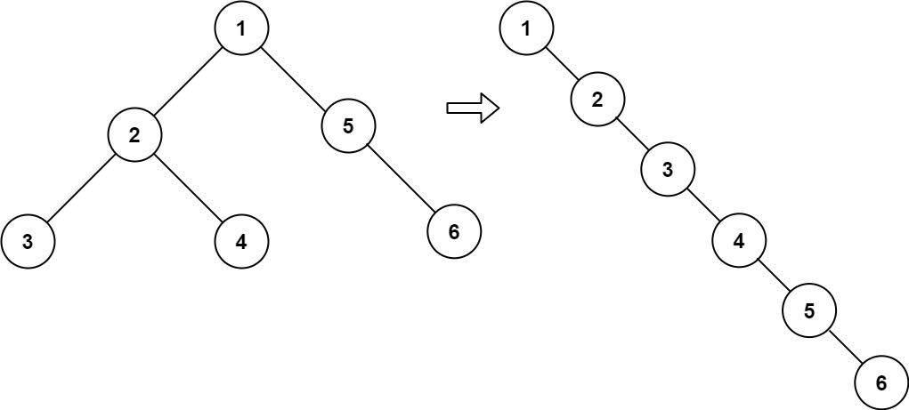

## Algorithm

[114. 二叉树展开为链表](https://leetcode.cn/problems/flatten-binary-tree-to-linked-list/description/?envType=study-plan-v2&envId=top-100-liked)

### Description

给你二叉树的根结点 root ，请你将它展开为一个单链表：

- 展开后的单链表应该同样使用 TreeNode ，其中 right 子指针指向链表中下一个结点，而左子指针始终为 null 。
- 展开后的单链表应该与二叉树 先序遍历 顺序相同。


示例 1：



```
输入：root = [1,2,5,3,4,null,6]
输出：[1,null,2,null,3,null,4,null,5,null,6]
```

示例 2：

```
输入：root = []
输出：[]
```

示例 3：

```
输入：root = [0]
输出：[0]
```

提示：

- 树中结点数在范围 [0, 2000] 内
- -100 <= Node.val <= 100


进阶：你可以使用原地算法（O(1) 额外空间）展开这棵树吗？

### Solution

```java
class Solution {
    public void flatten(TreeNode root) {
        List<TreeNode> list = new ArrayList<>();
        preOrder(root, list);
        int size = list.size();
        for (int i = 1; i < size; i++) {
            TreeNode pre = list.get(i - 1);
            TreeNode now = list.get(i);
            pre.left = null;
            pre.right = now;
        }
    }

    public void preOrder(TreeNode root, List<TreeNode> list) {
        if (root == null) {
            return;
        }
        list.add(root);
        preOrder(root.left, list);
        preOrder(root.right, list);
    }
}
```

### Discuss

## Review


## Tip


## Share
