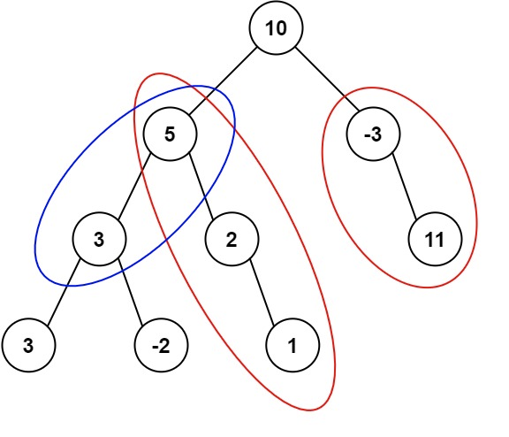

## Algorithm

[437. 路径总和 III](https://leetcode.cn/problems/path-sum-iii/?envType=study-plan-v2&envId=top-100-liked)

### Description

给定一个二叉树的根节点 root ，和一个整数 targetSum ，求该二叉树里节点值之和等于 targetSum 的 路径 的数目。

路径 不需要从根节点开始，也不需要在叶子节点结束，但是路径方向必须是向下的（只能从父节点到子节点）。

示例 1：



```
输入：root = [10,5,-3,3,2,null,11,3,-2,null,1], targetSum = 8
输出：3
解释：和等于 8 的路径有 3 条，如图所示。
```

示例 2：

```
输入：root = [5,4,8,11,null,13,4,7,2,null,null,5,1], targetSum = 22
输出：3
```

提示:

- 二叉树的节点个数的范围是 [0,1000]
- -109 <= Node.val <= 109
- -1000 <= targetSum <= 1000

### Solution

```java
class Solution {
    public int pathSum(TreeNode root, int targetSum) {
        if (root == null) {
            return 0;
        }
        return helper(root, targetSum, 0) + pathSum(root.left, targetSum) + pathSum(root.right, targetSum);
    }

    private int helper(TreeNode root, int targetSum, long currentSum) {
        if (root == null) {
            return 0;
        }
        currentSum += root.val;
        int count = 0;
        if (currentSum == targetSum) {
            count++;
        }
        count += helper(root.left, targetSum, currentSum);
        count += helper(root.right, targetSum, currentSum);
        return count;
    }
}
```

### Discuss

## Review


## Tip


## Share
