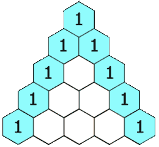

## Algorithm

[118. 杨辉三角](https://leetcode.cn/problems/pascals-triangle/description/?envType=study-plan-v2&envId=top-100-liked)

### Description

给定一个非负整数 numRows，生成「杨辉三角」的前 numRows 行。

在「杨辉三角」中，每个数是它左上方和右上方的数的和。



示例 1:

```
输入: numRows = 5
输出: [[1],[1,1],[1,2,1],[1,3,3,1],[1,4,6,4,1]]
```

示例 2:

```
输入: numRows = 1
输出: [[1]]
```

提示:

- 1 <= numRows <= 30

### Solution

```java
class Solution {
    public List<List<Integer>> generate(int numRows) {
        List<List<Integer>> result = new ArrayList<>();
        if (numRows >= 1) {
            List<Integer> list = new ArrayList<>();
            list.add(1);
            result.add(list);
        }
        if (numRows >= 2) {
            List<Integer> list = new ArrayList<>();
            list.add(1);
            list.add(1);
            result.add(list);
        }
        if (numRows >= 3) {
            for (int i = 2; i < numRows; i++) {
                List<Integer> list = new ArrayList<>();
                list.add(1);
                List<Integer> preList = result.get(result.size() - 1);
                for (int j = 1; j < preList.size(); j++) {
                    list.add(preList.get(j - 1) + preList.get(j));
                }
                list.add(1);
                result.add(list);
            }
        }
        return result;
    }
}
```

### Discuss

## Review


## Tip


## Share
